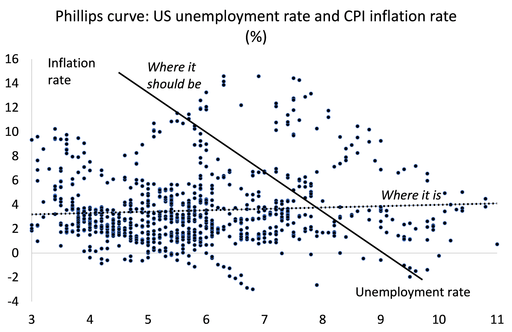
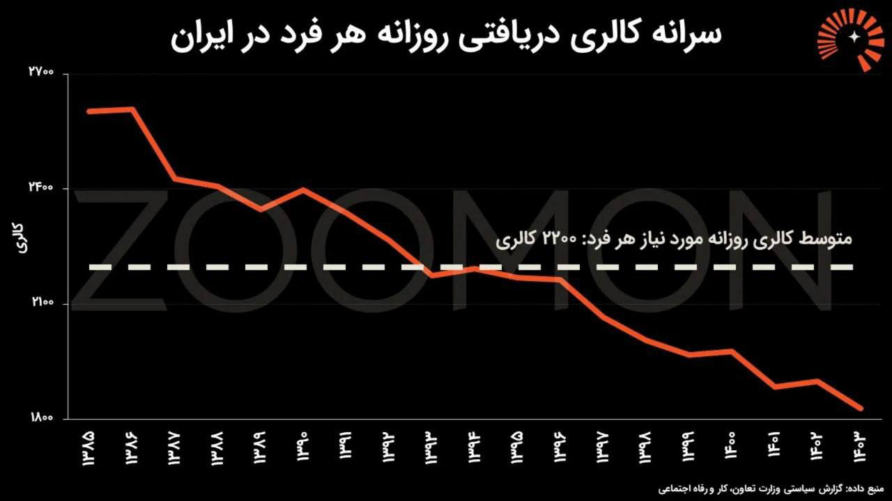
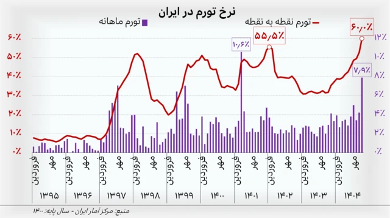
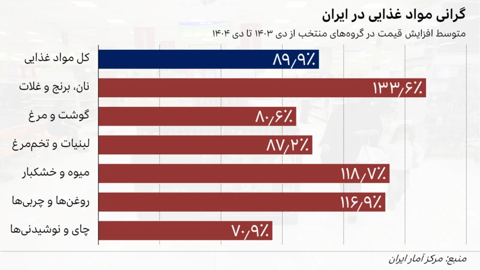
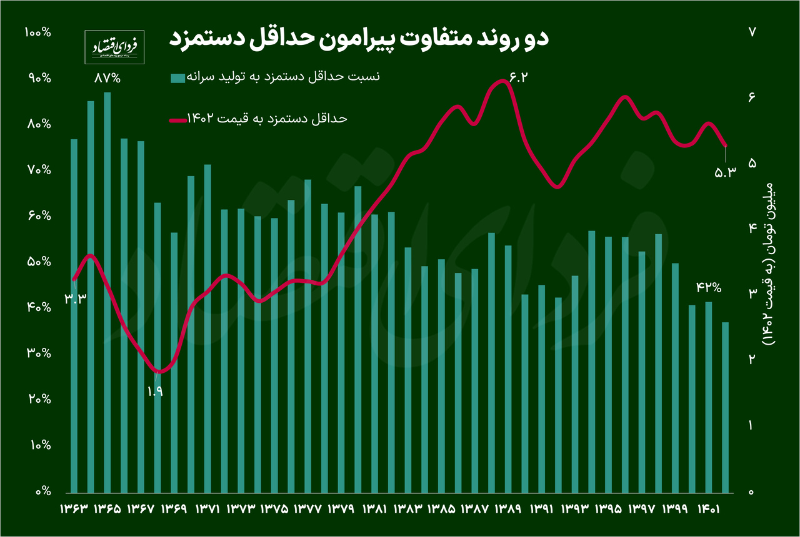
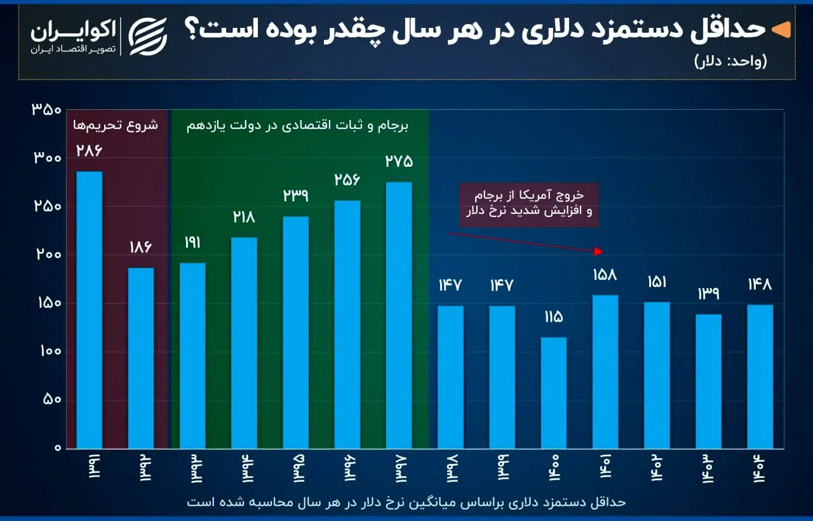
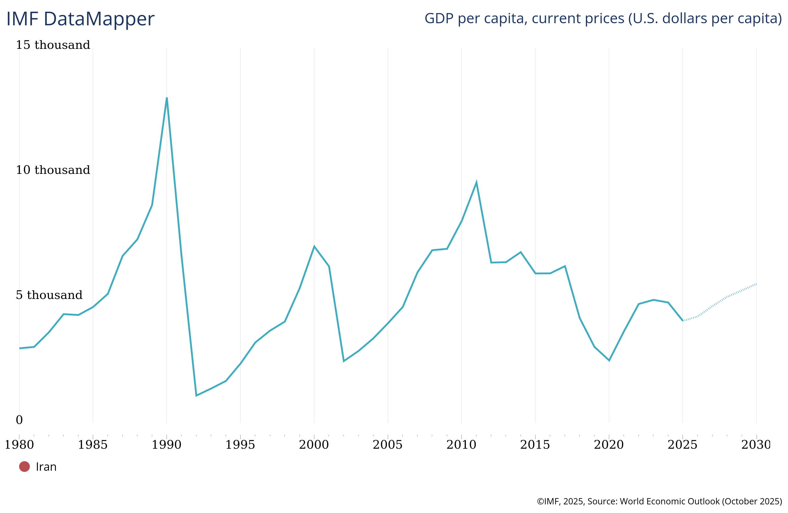

lang:fa
dir:rtl
title: افزایش دستمزد یعنی رکود و تورم؟ : بررسی بهانه‌های همیشگی
date: 1404-12-05
author: (پیشتاز) یحیی ستاری
summary: به زودی مذاکرات برای تعیین دستمزد برای سال آینده شروع خواهد شد، و به رسم هر سال قرار است انواع و اقسام بهانه‌ها برای توجیه جلوگیری از افزایش معنادار دستمزدها به کار گرفته شود.
cover: image/wage1405/cover.jpg
featured: true
# مقدمه

به زودی مذاکرات برای تعیین دستمزد برای سال آینده شروع خواهد شد، و به رسم هر سال قرار است انواع و اقسام بهانه‌ها برای توجیه جلوگیری از افزایش معنادار دستمزدها به کار گرفته شود. حال آنکه مطالبه‌ی کارگرانِ بخت‌برگشته‌ی ایرانی در چند سال اخیر نه افزایش حقیقی دستمزد، بلکه جلوگیری از آب شدن هرچه بیشتر آن بوده. دولت ایران، برخلاف آن چه در قانون کار ذکر شده، به کرات حداقل حقوق را پایین‌تر از نرخ تورم افزایش داده است که معنایی جز کمتر شدن حقیقی دستمزد و قدرت خرید کارگران ندارد.

باوجود وضعیت جنگی، فشار تحریم‌ها، وضع معیشتی فاجعه‌بار و خشم انباشته شده‌ی توده‌ها، منطقی به نظر میرسد که دولت با امتیازدهی و بهبود رفاه جامعه، پی آن باشد که فضای ملتهب کنونی را آرام کند. اما <u>سیاست‌ها براساس منطق و استدلال تعیین نمیشوند، بلکه نبرد و توازن قوای طبقاتی آن‌ها را تعیین میکنند.</u> سرمایه‌دار ایرانی، سرمست از قدرت بلامنازع‌اش در این توازن قوا که حاصل دهه‌ها سرکوب نیروهای کارگری و چپ در ایران و جهان بوده، گوشش بدهکار این حرف‌ها نیست و قصد دارد تا ته «قضیه» برود. اصل «قضیه»، همان است که در تمام نظام‌های سرمایه‌دارانه برقرار است : حداکثرسازی سود و انباشت سرمایه. اما «ته قضیه» در شرایط کنونی ایران کجاست؟ ته این قضیه هم آن‌طور که مورد پسند سرمایه‌دار ایرانی است، خاک‌کردن بقایای انقلاب ۵۷ و حتی نهضت ملی نفت است. و به نظر میرسد آشوب از داخل و تهاجم از خارج برای آن‌ها حکم تخریب خلاقانه‌ی سرمایه‌دارانه برای تسهیل دوباره‌ی روند انباشت و بازگشت به مدار امپریالیسم را دارد. و اگر مثل من بدبین باشید، ممکن است به این نتیجه برسید که این طبقه برای تسریع این روند، از قصد کشور را به سمت فروپاشی سوق میدهد.
در همچین شرایطی، دفاع از معیشت و دستمزد کارگر بیش از هر زمان دیگری حیاتی به نظر میرسد، و مهم است که کارگران و نیروهای کارگری مرعوب این لفاظی‌های شبه علمیِ لشگری از «دانش‌آموختگان اقتصاد» برای سرکوب دستمزد نشوند.

معمولا دو بهانه‌ی غالب برای عدم افزایش دستمزد داده میشود :
۱. رشد دستمزد به کسب و کارها ضربه میزند و باعث رکود و بیکاری میشود.
۲. افزایش دستمزد باعث تورم میشود و کشور وارد **مارپیچ قیمت-دستمزد** میشود.

بسیاری ممکن است تصور کنند که این بهانه‌ها به جا هستند، و بالا رفتن دستمزد از یک سو باعث بالا رفتن تقاضا میشود که نتیجتا منجر به افزایش قیمت‌ها و تورم میشود، و از سوی دیگر باعث ورشکستگی بنگاه‌ها و بیکاری میشود. در این یادداشت نشان خواهیم داد چرا این تصورات غلط‌اند و چرا علی‌رغم اثبات غلط بودنشان توسط داده‌های تجربی همچنان تکرار میشود. همچنین، خواهیم دید آنچه که تحت عنوان «علم اقتصاد» به شما می‌فروشند، که در ایران به مبتذل‌ترین شکل خود وجود دارد، نه تنها پیرو قواعد علمی نیست بلکه به شدت برپایه‌ی فرضیات غلط و/یا غیرواقعی با سویه‌های ایدئولوژیک و طبقاتی است.

## این ادعاها چیستند و از کجا آمده‌اند؟

*مارپیچ قیمت-دستمزد* (Wage-Price Spiral) در ادبیات اقتصاد کلان به فرآیندی اشاره دارد که در آن افزایش دستمزدهای اسمی منجر به افزایش هزینه‌های تولید و در نتیجه بالارفتن قیمت‌ها می‌شود؛ سپس کارگران برای جبران کاهش قدرت خرید ناشی از تورم، مجدداً درخواست افزایش دستمزد می‌دهند و چرخه تکرار می‌شود.
حائز اهمیت است که تاکید کنیم افزایش همزمان قیمت و دستمزد در سطوح ثابت، لزوماً به معنای یک مارپیچ مخرب نیست، بلکه ممکن است نشان‌دهنده‌ی روندی گذرا باشد. مشخصه‌ی اصلی این مارپیچ، *شتاب* (Acceleration) همزمانِ تورم و دستمزدهای اسمی است.

این فرضیه قدمتی به درازای خود سرمایه‌داری دارد و حتی به جریان‌های کارگری هم در تاریخ رسوخ پیدا کرده. در جریان انترناسیونال اول در سال ۱۸۶۵[^2] موضوع جدلی جدی میان مارکس و توماس وستون رهبر سندیکای نجاران بریتانیا شد. در همین باره، مارکس جزوه‌ای نوشت به نام «ارزش، قیمت و سود»[^3] و در آن به ادعاهای رایج درمورد دستمزد پاسخ داد. در ادامه به این اثر باز خواهیم گشت.

امروزه، اقتصاددانان جریان اصلی، به خصوص مکتب نوکنزی، همچنان بر این ادعا پافشاری میکنند. نکته‌ی جالب اما اینجاست که مکاتب اتریشی و مالی‌گرا که میان اقتصادخوانده‌های ایرانی محبوب هستند، تاثیر دستمزد در تورم را قبول ندارند. در این مکاتب، تورم حاصل افزایش عرضه‌ی پول در اقتصاد است، پس بالا رفتن دستمزد نمیتواند عامل تعیین‌کننده‌ی تورم باشد. از نظر آن‌ها، دستمزدها تابع تورم هستند نه بالعکس، و حتی اگر تورمی هم بعد از افزایش دستمزدها اتفاق بیافتد، گذرا و موقتی خواهد بود[^4]. در فضای فرهیخته‌ی بحث‌های اقتصادی امروزه در ایران، چنین ادعاهایی میتواند شما را متهم به کمونیست یا بیسواد بودن بکند! البته ناگفته نماند که امثال فریدمن مدعی نقش افزایش دستمزد در بیکاری هستند.

ادعای افزایش نرخ بیکاری براثر افزایش دستمزد هم در میان مکاتب جریان اصلی و اتریشی هم محبوبیت دارد. دراصل، این ادعا و ادعای تورم‌زا بودن دستمزد با یک دیگر مرتبط‌اند. در مقاله‌ای در سال ۱۹۵۸، ویلیام فیلیپس به رابطه‌ی معکوس افزایش دستمزد و بیکاری در بریتانیا اشاره میکند که بعدا به منحنی فیلیپس معروف میشود.[^5] این رابطه بعدا توسط پل ساموئلسون و رابرت سولو به تورم پیوند خورد[^6] تا این ایده را در سیاست‌های مالی بانک‌های مرکزی جا بندازد که برای مهار تورم باید بیکاری را افزایش داد. ایده‌ای که همچنان در سیاست‌های این نهادها و مدل نوکنزی پولی دنبال میشود[^8].

## چرا این بهانه‌ها مردود هستند؟

همه‌ی این ادعاها با شواهد تجربی رد شده‌اند.

منحنی فیلیپس که در مقاله‌ی ساموئلسون و سولو با دست کشیده شده، بارها توسط تجربیات تاریخی، از جمله رکود تورمی دهه‌ی ۷۰ میلادی، رد شده است. یافته‌های اخیر با استفاده از ابزارهای اقتصادسنجی نشان میدهند که این منحنی که در اصل باید کاهش شدیدی را نشان دهد، مسطح است؛ حتی در داده‌های مورد استفاده‌ی ساموئلسون و سولو[^7]. مثال‌های نقض دیگر در دیگر کشورها هم بسیارند[^9]، حتی در خود ایران هم تحقیقات مختلفی در این موضوع انجام شده و اعتبار منحنی فیلیپس در شرایط ایران را رد کرده[^10].
حقیقت این است که بیشتر از آنکه باید دنبال مثال نقض برای این منحنی باشیم، بهتر است به دنبال موارد نادری بود که اساسا این منحنی و فرضیه‌ی پشتش کار میکنند! این است دقت «علم اقتصاد» و راهبه‌های متکبرش که عوام باید دربرابرشان زانو بزنند و هر سیاستی که بهشان تحمیل میکنند را بپذیرند!

درمورد تورم‌زا بودن افزایش دستمزد و مارپیچ قیمت-دستمزد هم یافته‌های فراوانی در رد این ادعا هست. [سال ۲۰۲۲، صندوق بین‌المللی پول پژوهشی منتشر کرد که در آن به بررسی تاریخی حقانیت این مارپیچ پرداخته](https://www.imf.org/-/media/files/publications/wp/2022/english/wpiea2022221-print-pdf.pdf) و به این نتیجه رسیده که این پدیده از لحاظ تاریخی وجود خارج نداشته است. به گفته‌ی آنان :

> مارپیچ دستمزد-قیمت، حداقل به تعریفی که به‌عنوان شتاب مداوم در قیمت‌ها و دستمزدها در نظر گرفته می‌شود، در سوابق تاریخی اخیر به‌سختی یافت می‌شود. از میان ۷۹ پدیده‌ای که از دهه ۱۹۶۰ تاکنون با شتاب گرفتن هم‌زمان قیمت‌ها و دستمزدها شناسایی شده‌اند، تنها تعداد اندکی پس از گذشت هشت سه‌ماهه، شتاب بیشتری را تجربه کردند. علاوه بر این، یافتن شتاب مداوم در مارپیچ دستمزد-قیمت در شرایطی مشابه امروز—جایی که دستمزدهای واقعی به‌طور چشمگیری کاهش یافته‌اند—حتی دشوارتر است. در این موارد، دستمزدهای اسمی معمولاً تا حدی با تورم همگام شده تا بخشی از افت دستمزد واقعی جبران شود و نرخ رشد دستمزد در سطحی بالاتر از دوره پیش از شتاب اولیه، ثبات می‌یابد. در نهایت، نرخ رشد دستمزد با سطح تورم مشاهده‌شده و تنگی بازار کار سازگار می‌شود. این مکانیزم به‌ندرت منجر به پویایی شتاب ماندگاری می‌شد که بتوان آن را مارپیچ دستمزد-قیمت توصیف کرد.

کاهش چشمگیر دستمزدهای واقعی دقیقا معضلی است که کارگران ایران با آن دست و پنجه نرم میکنند. در ادامه اضافه میکنند :

> ما مارپیچ دستمزد-قیمت را به‌عنوان پدیده‌ای تعریف می‌کنیم که در آن حداقل در سه از چهار سه‌ماهه متوالی، هم قیمت مصرف‌کننده شتاب گرفته و هم دستمزد اسمی افزایش یافته باشد ... شاید به‌طور شگفت‌آور، تنها اقلیت کوچکی از چنین پدیده‌هایی با شتاب مداوم در دستمزدها و قیمت‌ها همراه بوده‌اند. در عوض، تورم و رشد دستمزد اسمی معمولاً ثبات می‌یافتند و رشد دستمزد واقعی در مجموع بدون تغییر باقی می‌ماند. تجزیه‌وتحلیل پویایی دستمزدها با استفاده از منحنی فیلیپس دستمزد نشان می‌دهد که رشد دستمزد اسمی معمولاً در سطحی ثابت می‌شود که با تورم مشاهده‌شده و تنگی بازار کار سازگار است. هنگامی که تمرکز بر پدیده‌هایی باشد که الگوی اخیرِ کاهش دستمزد واقعی و تنگ‌تر شدن بازار کار را تقلید می‌کنند، کاهش تورم و افزایش رشد دستمزد اسمی معمولاً دنبال می‌شود—که این امر امکان جبران تدریجی دستمزد واقعی را فراهم می‌آورد.

این یافته‌ها تایید استدلالی‌است که مارکس بیش از ۱۶۰ سال پیش آن را ارائه کرد. او در جزوه‌ی «ارزش، قیمت و سود» خاطر نشان میکند که مطالبات مزدی معمولا در واکنش به تورم اتفاق میافتند و در پی بازپسگیری قدرت خرید از دست رفته هستند. او استدلال میکند :

> مبارزه برای افزایش دستمزد فقط در پی تغییراتی می آید که پیشتر روی داده‌اند. این مبارزه، نتیجه ناگزیر و تَبَعی تغییراتی است که قبلا در کمیت تولید، در نیروھای مولد کار، در ارزش کار، در ارزش پول، در طولانی‌تر کردنِ مدت کار و یا شدت و فشردگی کار استخراج شده بوجود آمده بودند، آن تغییرات سپس در نوسانات قیمت‌ھاى بازاری که تابع نوسانات عرضه و تقاضا و در ارتباط با دوره‌ھای مختلف بحران و شکوفائی صنعتی است، انعکاس یافته‌اند. بطور خلاصه آن مبارزه برای افزایش دستمزد واکنشی است که کار در برابر کنشِ قبلی سرمایه نشان میدھد.

قیمت کالاها توسط *میزان کار اجتماعا لازم* برای تولید آن‌ها تعیین میشود که خود تابع شرایط و سازماندهی تولید و نیروهای مولد است. همانطور که مارکس هم در جزوه‌اش به آن اشاره میکند، فاکتورهای مختلفی بر قیمت تاثیر میگذراند مانند میزان تولید (نرخ‌های رشد)، قدرت مولد کار (رشد بهره‌وری یا کارآمدی)، ارزش پول (رشد نقدینگی و در مورد مشخص ایران، نرخ ارز)، نوسانات بازار و دوره‌های چرخه صنعتی (دوره‌های رونق و رکود). طبقه‌ی کارگر در این پروسه فقط بخشی از این ارزش کل تولید شده را در قالب دستمزد (سرمایه متغیر) دریافت میکنند و باقی مانده‌ی ارزش پس از کسر هزینه‌های دیگر (سرمایه ثابت) در قالب سود (ارزش مازاد) به جیب سرمایه‌دار میرود. مارکس تاکید میکند که «افزایش عمومی نرخ دستمزد منجر به کاهش نرخ عمومی سود می‌شود، اما بر قیمت کالاها تأثیری نمی‌گذارد.». شواهد عینی و مطالعات تجربی هم حق را به مارکس میدهند و حرف او را تایید میکنند. مایکل رابرتز، اقتصاددان مارکسیست، در وبلاگ خود، [توضیح علل تورم از منظر مارکسیستی](https://thenextrecession.wordpress.com/2020/08/21/a-marxist-theory-of-inflation/) را بیشتر تشریح میکند. 

[در ایران هم مارپیچ دستمزد-قیمت مشاهده نشده، و عامل اصلی تورم نرخ ارز و وضعیت تولید شناخته میشود](https://aes.basu.ac.ir/article_1412_f5012ec7eaf6b6992faa348ba5420040.pdf).
مجیدرضا حریری، عضو اتاق بازرگانی و رییس اتاق ایران و چین در [مصاحبه‌ای با تجارت‌نیوز ](https://tejaratnews.com/%D8%B3%D9%87%D9%85-%D9%85%D8%B2%D8%AF-%D8%AF%D8%B1-%D9%87%D8%B2%DB%8C%D9%86%D9%87-%D8%AA%D9%88%D9%84%DB%8C%D8%AF-%D8%A7%D8%B9%D9%84%D8%A7%D9%85-%D8%B4%D8%AF) میگوید :

> در بخش تولید کالا ۷ درصد از هزینه نهایی را دستمزد کارگران تشکیل می‌دهد و در خدمات یک مقدار این نرخ بیشتر است. توجه کنید که نوسانات ارزی در این یک سال به تنها ۶۰ تا ۷۰ درصد هزینه های تولید را افزایش دادند ولی اگر مزد ۱۰۰ درصد افزایش پیدا کند، هزینه نهایی تولید تنها ۷ درصد بیشتر می‌شود.

[به گزارش ایسنا](https://www.isna.ir/news/1404102815329/سهم-دستمزد-کارگر-در-قیمت-تمام-شده-چقدر-است)، با استناد به کارشناسان این حوزه، در اقتصاد ایران «سهم دستمزد در قیمت تمام شده تولید بین ۹ تا ۱۳ درصد است.»

به همین صورت، رابطه‌ی بین افزایش دستمزد و بیکاری نیز پیچیده‌تر از ساده‌انگاری‌های مرسوم برای بیشتر کردن بهره‌کشی از کارگران است.
اولا، این نکته را باید بیان کرد که کارگران درقبال سوددهی بنگاه‌های اقتصادی مسئول نیسنتد، و قرار نیست برای راضی نگه داشتن آنان تن به بردگی بدهند. دوما، اکثر یافته‌های تجربی نشان داده‌اند که حداقل دستمزد تاثیر محسوسی بر اشتغال ندارد.[^1] همانند تورم، بیکاری هم متاثر از متغیرهای مختلف اقتصادی است و رابطه‌ای علّی و خطی میان دستمزد و اشتغال وجود ندارد. در مواردی، افزایش دستمزد میتواند نتیجه‌ای عکس آن چیزی که ادعا میشود داشته باشد. همانطور که بالاتر مطرح کردیم، افزایش دستمزد سهم کار در تقسیم ارزش را بیشتر میکند و سود را پایین میاورد. این خود باعث بالا رفتن قدرت خرید و نتیجتا تقاضا در اقتصاد میشود که میتواند عاملی برای رشد و رونق بنگاه‌ها باشد. این کار مخصوصا در کشوری مثل ایران که همه میدانیم سودهای حاصل از بهره‌کشی سر از کانادا و اروپا و دوبی و غیره درمیاورند میتواند جلوی غارت بیشتر را بگیرد و راهگشا باشد برای برون‌رفت از رکود فعلی.
[تجربه‌ی اخیر اسپانیا](https://www.imf.org/en/publications/fandd/issues/2025/06/spains-shift-to-success-carlos-cuerpo) که همزمان با بالا بردن حقیقی دستمزدها و بهبود وضعیت قراردادها به نفع کارگران، یکی از بهترین رشدهای اقتصادی اتحادیه اروپا را داشته. [در رومانی هم این تجربه وجود داشته](https://t.me/kargah_tv/653). این تجربه در ایران هم وجود داشته همانطور که [رسانه‌ی کارگاه گزارش کرده](https://t.me/kargah_tv/623). در گزارشی که این رسانه برای پویش سال ۱۴۰۴ آماده کرده بودن، گفته میشود

>در سال ۱۴۰۱ حداقل دستمزد کارگران ۵۷ درصد افزایش یافت. مدعیان «علم اقتصاد» معتقد بودند این میزان افزایش دستمزد باعث تعطیلی کارگاه‌ها و اخراج‌ گسترده کارگران می‌شود. 
>
>در پایان سال ۱۴۰۱ نرخ بیکاری از ۹.۲ به ۸.۹ درصد کاهش یافت.
>
>همچنین تعداد مقرری‌بگیران بیمه بیکاری نیز ۲۹ درصد کاهش یافت.
>
>بنابراین در سال ۱۴۰۱ با افزایش قابل توجه حداقل دستمزد، کارگران کمتری بیکار شدند و حتی بیکاران بیشتری جذب بازار کار شدند.

## ضرورت دوچندان مبارزه برای دستمزد در ایران

در بخش قبل دیدیم که این بهانه‌ها هیچکدوم بنیان‌های تجربی و عینی ندارند. پس تکرار مداوم‌اشان نه بر اساس منطق و علم که براساس منافع سیاسی و طبقاتی است. این سویه‌ی ایدئولوژیک حتی در بین اقتصاددانان معروف که وزن آکادمیک دارند مشهود است، چه برسد به بلاگرهای مبتذل اقتصادی که مامور حفظ منافع طبقه‌ی منتفع از این شرایط هستند.

طبقه‌ی کارگر ایرانی در چند سال اخیر شدیدا تحت فشار قرار گرفته و تمام بار تحریم‌ها بر روی دوش آنان گذاشته شده است. بر اساس [گزارش اخیر بانک جهانی](https://www.worldbank.org/en/country/iran/publication/iran-economic-monitor)، بیش از ۳۱ میلیون ایرانی در سال ۱۴۰۴ در فقر مطلق زندگی می‌کردند که ۳۶ درصد از جمعیت کشور است. همچنین به [گزارش تجارت نیوز](https://tejaratnews.com/%d8%a7%d8%ac%d8%b1%d8%a7%db%8c-%d9%be%d8%b1%d9%88%da%98%d9%87-%d8%a7%d9%86%d8%aa%d9%82%d8%a7%d9%84-%d9%be%d8%a7%db%8c%d8%aa%d8%ae%d8%aa-%d8%af%d8%b1-%d8%a7%d9%88%d9%84%d9%88%db%8c%d8%aa-%d9%86%db%8c)، نرخ فقر در سال ۱۴۰۵ ممکن است به ۳۸.۸ درصد برسد.

طبق گزارش سیاستی وزارت تعاون، کار و رفاه اجتماعی، اکثر ایرانیان حتی میزان کالری مورد نیاز روزانه را دریافت نمیکنند، و سرانه‌ی کالری دریافتی روزانه در ایران به نزدیک ۱۸۰۰ رسیده درمقابل ۲۲۰۰ مورد نیاز[^11]. تورم نقطه به نقطه در مهر ماه ۱۴۰۴ ۶۰٪ را هم رد کرد و به احتمال زیاد تا پایان سال این رقم بیشتر هم بشود. وضع تورم مواد غذایی، که به خصوص فقیرترین اقشار جامعه را هدف قرار میدهد، حتی از این هم بدتر است و با سلاخی اقتصادی دولت شیکاگویی در دی ماه به نزدیک ۹۰٪ رسید.

این شرایط صرفا به خاطر فشار تحریم‌ها نیست. در چند دهه‌ی گذشته، سهم حداقل حقوق از سرانه‌ی تولید ناخالص داخلی در روندی نزولی بوده. همچنین نرخ دلاری حداقل دستمزد -هنگام نگارش این مقاله- از ۸۰ دلار هم پایین‌تر رفته که[ کمترین‌ها میزان در کل غرب آسیاست](https://www.mehrnews.com/news/2328650/%D8%AC%D8%AF%D9%88%D9%84-%D9%85%D9%82%D8%A7%DB%8C%D8%B3%D9%87-%D8%A7%DB%8C-%D8%AF%D8%B3%D8%AA%D9%85%D8%B2%D8%AF%D9%87%D8%A7-%D8%AF%D8%B1-16-%DA%A9%D8%B4%D9%88%D8%B1-%D9%87%D8%B1-%DA%A9%D8%A7%D8%B1%DA%AF%D8%B1-%D8%AF%D8%B1-%D9%85%D8%A7%D9%87-%DA%86%D9%86%D8%AF-%D8%AF%D9%84%D8%A7%D8%B1). 

این درصورتی‌است که بلاگرهای اقتصادی ادعا میکنند که دستمزد تابع تولید اقتصادی است، اما حتی اگر سال ۹۸ را که یکی از بدترین سال‌ها از لحاظ اقتصادی و تاثیر تحریم‌ها شناخته میشود، دستمزد دلاری نزدیک به ۱۵۰ دلار بود. اما آیا همان بلاگرها با دستمزدی که ارزش تومانی‌اش هنگام نگارش این مطلب نزدیک به ۲۵میلیون تومان است، موافقت خواهند کرد؟ جواب را احتمالا خودتان میدانید.

ایران در دی ماه ۱۴۰۴ خونین‌ترین اعتراضات تاریخ معاصر خود را تجربه کرد. بی‌شک سرمایه‌داری ایران در بحرانی عمیق فرورفته و این در رفتارش کاملا مشهود است. آن‌ها حتی در درک این موضوع که باید حداقل حقوقی بدهند که نیروی کارشان توان بازتولید خود را داشته باشد هم عاجز هستند. این وضعیت به احتمال زیاد بدتر هم خواهد شد با توجه به استیصال و انفعال کامل دولت در تقریبا همه‌ی امور.

مبارزه برای افزایش دستمزد بیش از هر زمان دیگری در ایران حیاتی شده است، و در وضعیت فعلی فراتر از یک درخواست صنفی تبدیل به فریادی برای حفظ موجودیت ایران شده. پافشاری بر این موضوع، پافشاری بر بقای دولت-ملت ایران است که تحت تهاجم بی‌امان امپریالیستی مستهلک، خسته و در آستانه‌ی از هم گسستن است. اگر باز به این درخواست‌ها بی‌اعتنایی شود و دستمزدها به طور حقیقی افزایش نیابد، به احتمال زیاد شورشی به مراتب خشونت‌بارتر از دی ۱۴۰۴ اتفاق خواهد افتاد. و باتوجه به تجمع کم‌سابقه‌ی نیروهای نظامی دشمن در منطقه و تحرکات نیروهای نیابتی‌اشان در شرق و غرب کشور، پافشاری بر ادامه‌ی رویه‌ی کنونی یعنی پافشاری بر سوق دادن کشور به سمت هرج و مرج و انهدام اجتماعی.

[علیرضا میرغفاری و سندیکای کارگران پارس جنوبی پیشقدم شدند و پویشی برای دستمزد ۱۴۰۵ شروع کرده‌اند](https://x.com/kargahtv/status/2024732924864582031?s=46) که امیدوارکننده است. میرغفاری به خصوص بر ضرورت تشکل‌یابی کارگران تاکید میکند که لازمه‌ی ایجاد توازن قوا به نفع طبقه‌ی کارگر است. او همچنین تقاضای بازنگری فصلی دستمزدها را دارد که برای حفظ معیشت مزدبگیران در کشوری با تورم بالا مانند ایران ضروری است. در چندسال اخیر این رویه در ترکیه که با تورم شدید دست و پنجه نرم میکند مرسوم شده است. رویه‌ای که رییس جمهور این کشور را در قدرت نگه داشته است.

اما طبقه‌ی کارگر راهی جز امتداد مبارزه‌ی صنفی-سیاسی در جهت حاکمیت طبقه‌ی کارگر و لغو سیستم سرمایه‌داری و جایگزینی‌اش با یک سیستم سوسیالیستی ندارد. از این رو، باید به کسب و نشر آگاهی سیاسی و طبقاتی پرداخت و متشکل شد.

مارکس در پایان جزوه‌اش مینویسد :

> در عین حال، حتی اگر کل وضعیت بردگی را که در سیستم مزدی نهفته است، به کلی کنار بگذاریم؛ طبقه کارگر نباید نتایج نهایی این مبارزه روزمره را برای خود بزرگنمایی و در آنها مبالغه کند. آنها نباید فراموش کنند که دراین مبارزه روزانه و دائمی، فقط بر علیه معلول‌ھا مبارزه میکند و نه بر علیه ریشه و عللی که آن مشکلات و نتایج را بوجود آورده و خلق کرده است. که این مبارزات روزمره و دائمی فقط جلوی موانعی را که موجب بدتر شدن وضع اوست میگیرد، ولی جهت آن را تغییر نمیدھد. که آنان آرام بخش و مُسَکِن به کار میبرند، ولی بیماری را معالجه نمیکنند. کارگران، بنابراین، نباید تماما در این نبردھای ناگزیر پارتیزانی ھضم شوند، جنگ و گریزھایی که دائما از تعرض لاینقطع سرمایه و یا تغییرات در بازار، ناشی میشوند. آنان باید درک کنند و بفهمند که سیستم موجود، با ھمه فلاکت‌ھایی که به آنان تحمیل میکند، درھمان حال و تواما شرایط مادی و اشکال اجتماعی لازمه برای تجدید ساختمان و بازسازی اقتصادی جامعه را نیز فراھم کرده است. **کارگران به جای شعار محافظه کارانه:“ دستمزدعادلانه برای روز کار عادلانه“ باید این فراخوان انقلابی بر پرچم‌شان نقش ببندد: “ الغاء سیستم مزدی“!**[^13]

مبارزهٔ طبقاتی در ایران، بخشی جدایی‌ناپذیر از مبارزه‌ای جهانی است: جنگ سرمایه‌داری جهانی به سرکردگی ایالات متحدهٔ آمریکا علیه بشریت. مبارزه‌ای که در پیوندی تنگاتنگ و ارگانیک با رویارویی دیگر ملت‌ها، از جمله مردم فلسطین، با همین نظم ویرانگر است. از این رو، نمی‌توان در عین ادعای استکبارستیزی، همان نظمِ مورد ارادهٔ «استکبار» را در یکی از وحشی‌ترین تجلیاتش پیاده کرد. به همین ترتیب، نمی‌شود ادعای دفاع از کارگران و مردم ایران را داشت و خود را خارج از این چارچوب کلی و بخشی از آن ندانست.

در این لحظه‌ی حساس، مقاومت طبقه‌ی کارگر دربرابر طبقه‌ی حاکم بر اقتصاد ایران، فراتر از مطالبه‌ای معیشتی است، مقاومتی است دربرابر سیاهی و ویرانی. مقاومتی است برای حیات و استقلال این سرزمین و ساکنانش. مقاومتی است دربرابر [ناوهای استعمارگران که برای غارت و نابودی آمده‌اند](https://pishtaz-ml.github.io/%D8%B3%DB%8C%D8%A7%D8%B3%D8%AA%20%D9%88%20%D8%AC%D8%A7%D9%85%D8%B9%D9%87/%D8%B8%D9%87%D9%88%D8%B1%20%D8%B1%D8%A7%DB%8C%D8%B4%20%DA%86%D9%87%D8%A7%D8%B1%D9%85%20%D8%BA%D8%B1%D8%A8%DB%8C%20%D9%88%20%D8%B6%D8%B1%D9%88%D8%B1%D8%AA%20%D8%A8%D8%A7%D8%B2%DB%8C%D8%A7%D8%A8%DB%8C%20%D8%AC%D8%A8%D9%87%D9%87%E2%80%8C%DB%8C%20%D9%85%D8%AA%D8%AD%D8%AF%20%D8%B6%D8%AF%D9%81%D8%A7%D8%B4%DB%8C%D8%B3%D8%AA%DB%8C/).

---
### پانوشت‌ها و منابع

[^1]: Dube, Arindrajit, and Ben Zipperer. _Own-Wage Elasticity: Quantifying the Impact of Minimum Wages on Employment_. 2024.

[^2]: بله، بالای ۱۶۰ سال پیش! عمده‌ی فرضیات و استدلال‌های طرفداران سرمایه‌داری همین‌قدر قدیمی و منسوخ هستند، اما مارکسیست‌ها را متهم به قدیمی بودن میکنند.

[^3]: کارل مارکس؛ ارزش، قیمت و سود؛ ۱۸۸۵؛ https://www.marxists.org/farsi/archive/marx/works/1865/arzesh-gheymat-sood.pdf

[^4]: برای مثال میتوانید به مقاله‌ی "The Role of Monetary Policy" فریدمن رجوع کنید.

[^5]: Phillips, A. W. (1958). The relation between unemployment and the rate of change of money wage rates in the United Kingdom, 1861-1957. _economica_, _25_(100), 283-299.

[^6]: Frisch H. The Phillips curve. In: _Theories of Inflation_. Cambridge Surveys of Economic Literature. Cambridge University Press; 1984:30-89.

[^7]: Hall, T. E., & Hart, W. R. (2012). The Samuelson–Solow Phillips curve and the great inflation. _History of Economics Review_, _55_(1), 62-72.

[^8]: در نسخه‌های نوین "انتظارات تورمی" هم به این معادلات اضافه شدند که مفهوم موهوم و ابطال‌ناپذیری همچون "مطلوبیت" است. انتظارات تورمی معمولا با نظرسنجی‌ها و نرخ‌های شناور بهره سنجیده میشوند.

[^9]: در [این بلاگ](https://www.apricitas.io/p/the-life-death-and-zombification?s=r)مفصل به این موضوع پرداخته شده.

[^10]: میتوان به مطالعات انجام شده در [دانشگاه فردوسی مشهد](https://civilica.com/doc/2224755/)، [دانشگاه تهران](https://jte.ut.ac.ir/article_99977_d9571d456b4e56c54553bc336b3391fe.pdf) و [دانشگاه مفید](https://economic.mofidu.ac.ir/article_29785.html) اشاره کرد.

[^11]: درمورد حداقل مورد نیاز اختلاف نظر وجود دارد، چون انستیتو تغذیه ایران حداقل کالری را ۲۳۸۶ اعلام کرده است. در هر دو صورت، ما با یک فاجعه روبرو هستیم.

[^12]: ی

[^13]: اینجا منظور سیستم مزدی سرمایه‌دارانه است که براساس بهره‌کشی است، و در آن ارزش نیروی کار توسط مکانیسم‌های بازار و حداکثرسازی سود تعیین میشود (میزان کار اجتماعا لازم برای بازتولید نیروی کار). میتوان سیستمی را متصور شد که در آن دستمزد به معنای عام وجود دارد، اما نظام اقتصادی از این قواعد سرمایه‌دارانه برای تعیین دستمزد تبعیت نمیکند.
