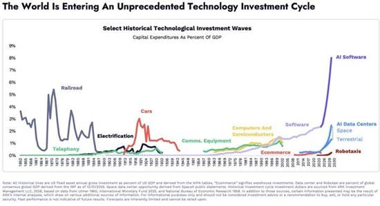
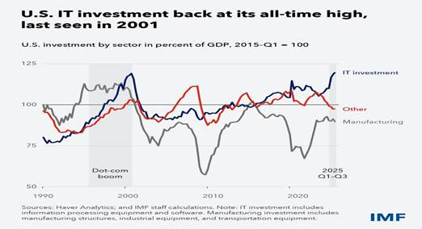
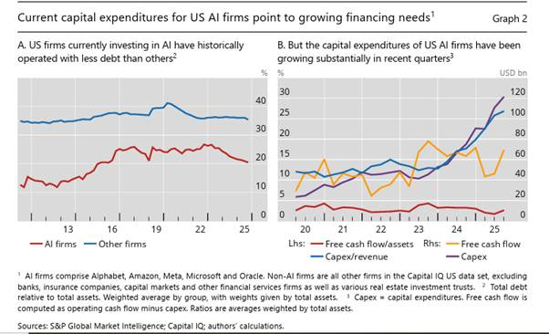
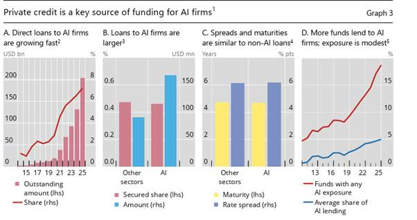
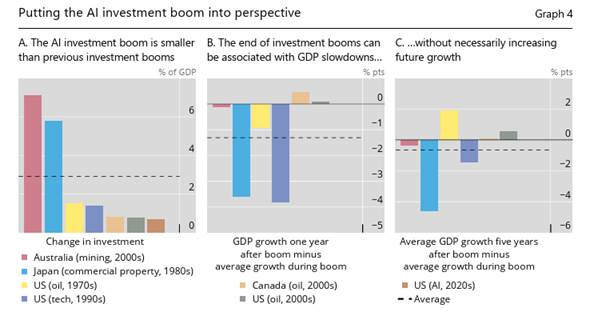

lang:fa
dir:rtl
title:  هوش مصنوعی و تخریب خلاقانه
date: 1404-11-21
author: (Michael Roberts) مایکل رابرتز
summary: مایکل رابرتز، اقتصاددان مارکسیست بریتانیایی، در این مقاله به توجه گسترده‌ی سرمایه به هوش مصنوعی و سرمایه‌گذاری‌های عظیم در این حوزه میپردازد. او استدلال میکند که پیشرفت در این حوزه به احتمال زیاد در کوتاه مدت باعث ترکیدن حباب ناشی از انتظارات نامعقول و سقوط شرکت‌های ضررده خواهد شد. اما در بلندمدت میتواند بهره‌وری نیروی کار را برای سرمایه با «تخریب خلاقانه» بالا ببرد. امری که ضربه‌ای مهلک به کارگران قربانی این تحول خواهد زد.
cover: image/roberts-ai/image.webp
featured: true

---

### توضیحات

مایکل رابرتز، اقتصاددان مارکسیست بریتانیایی، در این مقاله به توجه گسترده‌ی سرمایه به هوش مصنوعی و سرمایه‌گذاری‌های عظیم در این حوزه میپردازد. او استدلال میکند که پیشرفت در این حوزه به احتمال زیاد در کوتاه مدت باعث ترکیدن حباب ناشی از انتظارات نامعقول و سقوط شرکت‌های ضررده خواهد شد. اما در بلندمدت میتواند بهره‌وری نیروی کار را برای سرمایه با «تخریب خلاقانه» بالا ببرد. امری که ضربه‌ای مهلک به کارگران قربانی این تحول خواهد زد.
این متن، که در تاریخ ۳ فوریه ۲۰۲۶ نوشته شده، از [وبلاگ «The Next Recession»](https://thenextrecession.wordpress.com/) ترجمه شده که توسط او اداره می‌شود. به خوانندگان دنبال کردن مطالب وی را توصیه میکنیم.
متن اصلی را میتوانید [اینجا](https://thenextrecession.wordpress.com/2026/02/03/ai-and-creative-destruction/) مطالعه کنید.

---

سرمایه‌گذاری شرکت‌های «هایپراسکیلر» (hyperscalers) و غول‌های فناوریِ فعال در زمینه‌ی مراکز داده (data centers) و تراشه‌های مرتبط با هوش مصنوعی همچنان ادامه دارد. با این حال، رشد سرمایه‌گذاری مرتبط با هوش مصنوعی تاکنون از نظر تاریخی چندان گسترده نبوده است. بر اساس [مطالعه‌ای از بانک تسویه‌حساب‌های بین‌المللی (BIS)](https://www.bis.org/publ/bisbull120.pdf)، این سرمایه‌گذاری که حدود ۱ درصد تولید ناخالص داخلی آمریکا را شکل می‌دهد، از نظر حجم مشابه بوم (boom) نفت و گاز شیل آمریکا در اواسط دهه ۲۰۱۰ بوده و نصف رشد سرمایه‌گذاری فناوری اطلاعات در دوره‌ی بوم دات‌کام دهه ۱۹۹۰ است. بوم سرمایه‌گذاری در املاک تجاری و معادن در ژاپن و استرالیا به ترتیب در دهه‌های ۱۹۸۰ و ۲۰۱۰، بیش از پنج برابر بزرگ‌تر از این رقم نسبت به تولید ناخالص داخلی بوده است.

[شاید هنوز به حد «جنون راه‌آهن» قرن نوزدهم نرسیده باشد](https://thenextrecession.wordpress.com/2025/12/04/ai-and-the-railway-mania/)، اما در مسیر آن قرار دارد.

سرمایه‌گذاری کلی مرتبط با فناوری اطلاعات، از جمله سرمایه‌گذاری در سایر تجهیزات و نرم‌افزارهای فناوری اطلاعات، به ۵ درصد تولید ناخالص داخلی رسیده و از حداکثر قبلی خود در اوج بوم دات‌کام در سال ۲۰۰۰ فراتر رفته است.

سرمایه‌گذاری مرتبط با هوش مصنوعی اشکال مختلفی دارد. مستقیم‌ترین آن هزینه‌های مربوط به مراکز داده است که زیرساخت‌های فناوری اطلاعات لازم برای آموزش[^1]، استقرار و ارائه‌ی خدمات و کاربردهای هوش مصنوعی را در خود جای می‌دهند. این هزینه‌ها شامل هزینه‌های ساخت تأسیسات فیزیکی و همچنین هزینه‌های تجهیزات فناوری اطلاعات و برق مورد نیاز برای عملیات آن‌ها، از جمله سرورها و تجهیزات شبکه می‌شود.

برخلاف بوم دات‌کام که تقریباً کاملاً توسط هزینه‌های شرکت‌های مصرف‌کننده محصولات فناوری اطلاعات هدایت می‌شد، بوم کنونی تاکنون عمدتاً توسط شرکت‌های تولیدکننده فناوری اطلاعات پیش برده شده است. اما این الگو نیز در حال تغییر است. فراتر از مراکز داده، سرمایه‌گذاری مرتبط با هوش مصنوعی می‌تواند شامل تأسیسات تولید فناوری اطلاعات نیز باشد که تراشه‌ها و سخت‌افزارهای تخصصی مورد نیاز این سیستم‌ها را تولید می‌کنند. در نهایت، پیشرفت‌های هوش مصنوعی ممکن است سرمایه‌گذاری گسترده‌تری در محصولات فناوری اطلاعات را تحریک کند؛ مثلاً اگر هوش مصنوعی شرکت‌ها را به ارتقاء سخت‌افزار رایانه‌ها یا خرید نرم‌افزارهای جدید ترغیب کند.

بنابراین سرمایه‌گذاری مرتبط با هوش مصنوعی به محرک مهمی برای رشد اقتصادی آمریکا تبدیل شده است. از سهمی ناچیز قبل از سال ۲۰۲۲، هزینه‌های مربوط به تأسیسات تولید نیمه‌هادی‌ها و مراکز داده در سه سال بعد به‌طور میانگین ۰.۴ درصد از رشد تولید ناخالص داخلی را رقم زده‌اند.

پیش‌بینی می‌شود مراکز داده آمریکا تا سال ۲۰۳۰ نزدیک به ۱۰ درصد کل شبکه برق این کشور را مصرف کنند؛ یعنی چهار برابر درصدی که برای چین پیش‌بینی شده است. آمریکا حدود نیمی از مراکز داده جهان را در اختیار دارد در حالی که تنها ۴ درصد جمعیت جهان را تشکیل می‌دهد.

اگرچه فعالیت تولیدی آمریکا همچنان کمرنگ باقی مانده، سهم سرمایه‌گذاری فناوری اطلاعات از تولید اقتصادی آمریکا به بالاترین سطح خود از سال ۲۰۰۱ رسیده و سرمایه‌گذاری و فعالیت تجاری کلی را به شکل چشمگیری تقویت کرده است. اگرچه این رونق فناوری اطلاعات عمدتاً در آمریکا متمرکز بوده، اما اثرات مثبتی نیز در سطح جهانی ایجاد کرده، به‌ویژه بر صادرات فناوری آسیا.

سرمایه‌گذاری کلی فناوری اطلاعات که هزینه‌های شرکت‌ها برای تجهیزات و نرم‌افزارهای تسهیل‌کننده استفاده از هوش مصنوعی را نیز شامل می‌شود، در سه‌ماهه‌های اخیر نزدیک به نیمی از رشد تولید ناخالص داخلی را رقم زده و به محدود کردن اثرات منفی تعرفه‌های تجاری ترامپ بر رشد کمک کرده است. هزینه‌ی سالانه صرف‌شده صرفاً برای مراکز داده ممکن است در پنج سال آینده بین ۱۰۰ تا ۲۲۵ میلیارد دلار افزایش یابد. این امر باعث خواهد شد سهم هزینه مراکز داده به‌تنهایی از ۰.۵ درصد کنونی به بین ۰.۸ تا ۱.۳ درصد تولید ناخالص داخلی برسد.

اشتیاق مؤسسات مالی به بوم سهام [شرکت‌های مرتبط با] هوش مصنوعی همچنان کاهش نیافته است. شرکت‌های انویدیا، مایکروسافت و آمازون در مجموع قصد دارند ۶۰ میلیارد دلار در اوپن‌ای‌آی، طراح چت‌جی‌پی‌تی، سرمایه‌گذاری کنند. آمازون به تنهایی در نظر دارد ۵۰ میلیارد دلار در این شرکت سرمایه‌گذاری کند؛ در حالی که شاخه‌ی اروپایی سافت‌بانک برنامه دارد ۳۰ میلیارد دلار دیگر تزریق سرمایه کند. در همین حال، اوپن‌ای‌آی در حال جذب ۵۰ میلیارد دلار از سرمایه‌گذاران خاورمیانه است.

شرکت‌هایی که اکنون بوم سرمایه‌گذاری هوش مصنوعی را هدایت می‌کنند، تاریخچه‌ای از عملیات با بدهی بسیار کمتر نسبت به سایر شرکت‌ها دارند. در عوض، آن‌ها به جریان‌های نقدی حاصل از عملیات بسیار سودآور خود برای تأمین مالی سرمایه‌گذاری‌ها متکی بوده‌اند. با این حال، این شرکت‌ها هزینه‌های سرمایه‌ای (capex) خود را به‌طور چشمگیری افزایش داده‌اند؛ سرمایه‌گذاری‌ها هم از نظر مطلق و هم به‌عنوان سهمی از درآمدها رشد کرده‌اند. بنابراین حجم خالص این سرمایه‌گذاری‌ها اکنون از جریان نقدی فراتر رفته است.

تأمین مالی از طریق بدهی در حال گسترش است و اهرم مالی را افزایش می‌دهد. و اینجاست که خطر ترکیدن حباب در صورتی که بازدهی محقق نشود یا شرایط مالی سخت‌گیرانه‌تر شود، وجود دارد. علاوه بر این، سودآوری ناشی از سرمایه‌گذاری در هوش مصنوعی بسیار به استهلاک مکرر تراشه‌ها حساس است. این امر حاشیه سود را فشرده کرده و بنابراین نیاز به تأمین مالی اضافی از طریق بدهی را افزایش می‌دهد.

وام‌دهی توسط صندوق‌های اعتباری خصوصی (یعنی خارج از بانک‌های سنتی) به بخش‌های مرتبط با هوش مصنوعی به‌سرعت رشد کرده و اکنون از کمتر از ۱ درصد از کل حجم وام‌های معوق به تقریباً ۸ درصد رسیده است که بیش از ۲۰۰ میلیارد دلار است. چنین وام‌هایی از منابع تنظیم‌نشده (unregulated) ممکن است تا پایان دهه جاری سه‌برابر شوند. همچنین بسیاری از شرکت‌های حیاتی مرتبط با هوش مصنوعی در حال حاضر وارد بازار سهام نشده‌اند. بدهی‌های این شرکت‌ها ممکن است پیامدهایی داشته باشند که در دوره دات‌کام دیده نشد.

اوپن‌ای‌آی به‌ظاهر پیشتاز مسابقه هوش مصنوعی است. پس از راه‌اندازی چت‌جی‌پی‌تی در سال ۲۰۲۲، این استارتاپ به ۸۰۰ میلیون کاربر فعال هفتگی رسیده که بیش از دو برابر ترافیک هوش مصنوعی‌های رقیب است که توسط متا (مالک فیسبوک) و الفابت (شرکت مادر گوگل)  توسعه‌یافته‌اند. اما [هزینه‌ی باقی ماندن در این مسابقه بسیار گزاف بوده](https://www.ifre.com/people-and-markets/2348522/ai-financing-boom-begins-to-show-cracks-as-investors-balk-at-debt-binge). اوپن‌ای‌آی برنامه دارد ظرفیت پردازشی فعلی خود را از ۱.۹ گیگاوات به ۳۶ گیگاوات در هشت سال آینده افزایش دهد و مجموعه‌ای از توافق‌ها برای ساخت مراکز داده و خرید تراشه‌های پیشرفته بسته که در مجموع آن را با ۱.۴ تریلیون دلار بدهی مواجه کرده است. رقبای بزرگ‌تر مانند الفابت و متا کسب‌وکارهای قدیمی دارند که سالانه صدها میلیارد دلار درآمد تولید می‌کنند و می‌توانند از آن‌ها استفاده کنند. در مقابل، اوپن‌ای‌آی تنها تا زمانی می‌تواند بقا یابد که حامیانش تمایل داشته باشند آن را پابرجا نگه دارند.

اوپن‌ای‌آی از سال ۲۰۱۵ بیش از ۶۰ میلیارد دلار جذب کرده است، از جمله [۴۱ میلیارد دلار در سال گذشته در دوری که توسط سافت‌بانک](https://www.ifre.com/bonds/2240794/softbank-profits-fuelled-by-openai-stake) رهبری شد و بزرگ‌ترین دور جذب سرمایه در تاریخ بود. اما پیش‌بینی می‌شود امسال آخرین بخش از این نقدینگی را مصرف کند و با توجه به اینکه رسیدن به سودآوری هنوز چند سال دیگر طول خواهد کشید، سؤال این است که آیا سرمایه‌گذاران تمایل دارند این ماجراجویی عظیم و زیان‌ده را تأمین مالی کنند. شرکت اکنون با کمبود ۲۰ میلیارد دلاری در حساب‌هایش در امسال مواجه است، زیرا مجموعه‌ای از توافق‌های «الان بخر، بعداً بپرداز» با تأمین‌کنندگان از جمله انویدیا، اوراکل و کورویو (CoreWeave) موجبات فشار شدید برای یافتن سرمایه‌گذاران جدید و پُر پول را فراهم کرده است.

سال ۲۰۲۶ می‌تواند برای اوپن‌ای‌آی سرنوشت‌ساز باشد. با درآمدهایی که تنها کسری از هزینه‌های رو به رشد آن را شکل می‌دهد، پیش‌بینی می‌شود کمبود مالی آن در دو سال آینده به حدود ۱۳۰ میلیارد دلار برسد. اوپن‌ای‌آی در حال بررسی امکان عرضه عمومی سهام (IPO) به ارزش ۱۰۰ میلیارد دلار است. این مبلغ سه برابر بزرگ‌ترین IPO تاریخ خواهد بود: یعنی [۲۹.۴ میلیارد دلار عرضه سهام آرامکوی عربستان سعودی](https://www.ifre.com/equities/1943715/saudi-aramco-ipo-attracts-us119bn-of-demand) در سال ۲۰۱۹ که در آن زمان بیش از یک تریلیون دلار درآمد نفتی تولید می‌کرد.

بنابراین ترکیدن حباب هوش مصنوعی همچنان در دستور کار سال ۲۰۲۶ قرار دارد. فروپاشی ‌بوم‌های سرمایه‌گذاری قبلی به‌طور میانگین حدود ۱ درصد از رشد واقعی تولید ناخالص داخلی آمریکا را کاهش داد. همان‌طور که BIS بیان می‌کند: «اگر کاهش سرمایه‌گذاری در هوش مصنوعی همراه با اصلاح چشمگیر بازار سهام باشد، اثرات منفی جانبی می‌تواند بزرگ‌تر از بوم‌های قبلی باشد. سرمایه‌گذاران برای دسترسی به شرکت‌های هوش مصنوعی سهام آمریکا را ترجیح داده‌اند و اهرم مخفی ممکن است منجر به اثرات جانبی در بازار اعتبار شود. در کل، اگرچه هوش مصنوعی ممکن است افزایش پایداری در رشد اقتصادی ایجاد کند، هنوز باید دید که آیا این پتانسیل محقق خواهد شد.» [گیتا گوپینات، اقتصاددان سابق صندوق بین‌المللی پول، محاسبه کرده](https://www.economist.com/by-invitation/2025/10/15/gita-gopinath-on-the-crash-that-could-torch-35trn-of-wealth) که فروپاشی بازار سهام هوش مصنوعی معادل آنچه بوم‌ دات‌کام را پایان داد، حدود ۲۰ تریلیون دلار از ثروت خانوارهای آمریکایی و ۱۵ تریلیون دلار دیگر در خارج از آمریکا را از بین خواهد برد؛ مقداری که کافی است مصرف مصرف‌کنندگان را خفه کرده و رکود جهانی ایجاد کند. این دیدگاه صندوق بین‌المللی پول نیز است. صندوق نگران است که شرکت‌های هوش مصنوعی نتوانند سودی متناسب با ارزش‌گذاری‌های بالای خود ارائه دهند. حتی یک اصلاح متوسط در ارزش‌گذاری سهام هوش مصنوعی رشد جهانی را ۰.۴ درصد کاهش خواهد داد. «در ترکیب با افزایش کمتر از حد انتظار در بهره‌وری کل عوامل و اصلاح چشمگیرتر در بازارهای سهام، کاهش تولید جهانی می‌تواند بیشتر شود و عمدتاً در مناطق فناوری‌محور مانند آمریکا و آسیا متمرکز گردد.»

اما حتی اگر ترکیدن حباب اقتصاد آمریکا را به رکود سوق دهد، شاید این رکود تنها کوتاه‌مدت باشد، زیرا ممکن است اتخاذ گسترده هوش مصنوعی در تمام بخش‌ها باعث تغییر گامی در سطح بهره‌وری آمریکا شود. بسیاری از اقتصاددانان جریان اصلی نسبت به این امر خوش‌بین هستند. [اریک برینیولفسون، اقتصاددان دانشگاه استنفورد، پیش‌بینی می‌کند که هوش مصنوعی مسیری «J شکل» را طی خواهد کرد](https://www.aeaweb.org/articles?id=10.1257%2Fmac.20180386) که در آن ابتدا اثری کند و حتی منفی بر بهره‌وری وجود دارد در حالی که شرکت‌ها به‌طور سنگین در این فناوری سرمایه‌گذاری می‌کنند، پیش از آنکه در نهایت از مزایای آن بهره‌مند شوند. و سپس رونق واقعی آغاز می‌شود. چنین منحنی J شکلی در رشد بهره‌وری تولید آمریکا دیده شد که در اواسط دهه ۱۹۸۰ کاهش یافت و سپس پس از رکود ۱۹۹۱ به‌سرعت تا اواسط دهه ۲۰۰۰ شتاب گرفت.

بنابراین ابتدا حباب ترکیده، سپس رکود فرا می‌رسد، و در نهایت بازیابی مبتنی بر کاربردهای مرتبط با هوش مصنوعی آغاز می‌شود — دقیقاً همان‌گونه که پس از ترکیدن «جنون راه‌آهن» در اواسط قرن نوزدهم رخ داد. به نظر می‌رسد این دیدگاه [کوین وارش، نامزد ترامپ برای ریاست فدرال رزرو آمریکا](https://thenextrecession.wordpress.com/2026/01/31/kevin-warsh-wall-streets-man/) در ژوئن، نیز باشد. وارش معتقد است هوش مصنوعی با افزایش بهره‌وری به‌اندازه‌ای چشمگیر، روز را نجات خواهد داد تا جایی که یک «نیروی ضدتورمی قابل توجه» خواهد بود.

این همان نظریه‌ی «تخریب خلاقانه» است که ابتدا توسط اقتصاددان اتریشی ژوزف شومپیتر در قرن بیستم مطرح شد. این نظریه اخیراً توسط برنده‌های جدید جایزه نوبل اقتصاد، [فیلیپ آگیون و پیتر هاویت](https://cepr.org/voxeu/columns/sustained-growth-through-creative-destruction-nobel-laureates-philippe-aghion-and)، احیا شده است. آن‌ها استدلال می‌کنند که سرعت ظهور شرکت‌های جدید با فناوری جدید و سقوط شرکت‌های قدیمی با فناوری قدیمی با رشد بهره‌وری نیروی کار همبستگی مثبت دارد. «این ممکن است بازتاب مشارکت مستقیم تخریب‌آفرینی باشد.»

اما «تخریب خلاقانه» دو جنبه دارد. بهره‌وری افزایش می‌یابد، اما تنها پس از تخریب سرمایه قدیمی. هر «تغییر گامی» در بهره‌وری تنها از طریق رهاسازی نیروی کار ممکن خواهد بود. صندوق بین‌المللی پول تخمین می‌زند ۶۰ درصد شغل‌ها در اقتصادهای پیشرفته تحت تأثیر قرار خواهند گرفت. اقتصاددانان مورگان استنلی محاسبه کرده‌اند که بانک‌های اروپا ممکن است نیروی کار خود را تا سال ۲۰۳۰ حدود ۱۰ درصد کاهش دهند. این تخمین مبتنی بر بررسی ۳۵ وام‌دهنده بزرگ است که در مجموع حدود ۲.۱۲ میلیون نفر را استخدام کرده‌اند. کاهشی به این اندازه معادل [ناپدید شدن تقریباً ۲۱۲٬۰۰۰ شغل](https://www.techrepublic.com/article/news-it-unemployment-rate-ai-jobs/) در پنج سال آینده خواهد بود. [بر اساس مطالعه‌ای توسط سه پژوهشگر دانشگاه استنفورد](https://digitaleconomy.stanford.edu/publication/canaries-in-the-coal-mine-six-facts-about-the-recent-employment-effects-of-artificial-intelligence/)، هم‌اکنون شواهدی وجود دارد که اتخاذ هوش مصنوعی بر چشم‌انداز شغلی کارگران آمریکا تأثیر منفی گذاشته است. این مطالعه یافته‌هایی «اولیه و در مقیاس بزرگ متناسب با فرضیه‌ای که انقلاب هوش مصنوعی در حال تأثیر قابل توجه و نامتناسبی بر کارگران تازه‌وارد بازار کار آمریکا است» را نشان می‌دهد. کارگران بین ۲۲ تا ۲۵ سال در مشاغلی که بیشتر از بقیه‌ی مشاغل در معرض هوش مصنوعی قرار دارند — مانند خدمات مشتری، حسابداری و توسعه نرم‌افزار — از سال ۲۰۲۲ شاهد کاهش ۱۳ درصدی اشتغال بوده‌اند.

اقتصاد مبتنی بر عامل‌های هوش مصنوعی (AI agent) در حال شکل‌گیری است. عامل‌های هوش مصنوعی مصرف‌کننده (Consumer AI agents) اکنون در حال رزرو خودکار سفر و انجام خریدهای کوچک برای خریداران هستند. به زودی بخش بزرگ‌تری از فرآیند خرید پیچیده را مدیریت خواهند کرد: مذاکره بر سر قیمت‌ها و شرایط، هماهنگی تحویل و بازگشت کالاها، و انجام تراکنش با سایر عامل‌ها با سرعت ماشین. بازار جهانی عامل‌های هوش مصنوعی که در سال ۲۰۲۴ ارزشی معادل [۵.۴ میلیارد دلار داشت](https://www.grandviewresearch.com/industry-analysis/ai-agents-market-report)، [پیش‌بینی می‌شود تا سال ۲۰۳۴ به ۲۳۶ میلیارد دلار برسد](https://finance.yahoo.com/news/ai-agents-market-size-worth-144400570.html?guccounter=1&guce_referrer=aHR0cHM6Ly90aGVuZXh0cmVjZXNzaW9uLndvcmRwcmVzcy5jb20v&guce_referrer_sig=AQAAAKtPri4C0NUNi2EMYeTE9dzeKdAxiOwxwhZ6w6Y4xaOjN3GmBQ0FALQcv55K3-SkGxgAnBSUHOyAxFoRW_UkCddTIpFhZFpQ_LDGFHdocuMXaSoTNnSb6iyJDilHLPgEyhjPVRsDEZw3gPATUbNTp4bT2n_539CZZjuf9VLwEj8J).

برای کسب‌وکارها، این بدان معناست که سهم فزاینده‌ای از مشتریان دیگر انسان نخواهند بود. آن‌ها عامل‌هایی خواهند بود که به‌نیابت از افراد عمل می‌کنند و با عامل‌های دیگری که فروشندگان، ارائه‌دهندگان خدمات لجستیک و پردازنده‌های پرداخت را نمایندگی می‌کنند، تعامل خواهند داشت. بخش عمده‌ای از زنجیره تأمین تجاری ممکن است در نهایت عامل‌به‌عامل شود.

اما از دیدگاه تاریخی، جنبه دیگری نیز بر تأثیر فناوری وجود دارد. تغییر فناوری در طول تاریخ محرک اصلی رشد اشتغال بوده است. حدود ۶۰ درصد کارگران آمریکا امروز در مشاغلی کار می‌کنند که در سال ۱۹۴۰ وجود نداشتند. در دهه ۱۸۴۰، [فریدریش انگلس استدلال کرد که مکانیزاسیون شغل‌ها را از بین می‌برد، اما هم‌زمان شغل‌های جدیدی را در بخش‌های جدید ایجاد می‌کند](https://www.lulu.com/shop/michael-roberts/engels-200/paperback/product-y9pzdr.html?page=1&pageSize=4). در دهه ۱۸۵۰، مارکس دو جنبه تخریب خلاقانه را روشن‌تر بیان کرد: «واقعیت‌های عینی که توسط خوش‌بینی اقتصاددانان تحریف شده‌اند عبارتند از: کارگران، هنگامی که توسط ماشین‌آلات از کارگاه بیرون رانده می‌شوند، به بازار نیروی کار پرتاب می‌شوند. حضور آن‌ها در بازار نیروی کار تعداد نیروهای کاری را که در اختیار بهره‌برداری سرمایه‌داری قرار می‌گیرند، افزایش می‌دهد... اثر ماشین‌آلات که به‌عنوان جبران برای طبقه کارگر توصیف شده، در مقابل، شلاقی وحشتناک است... به محض اینکه ماشین‌آلات بخشی از کارگران شاغل در یک شاخه صنعتی را آزاد کند، مردان ذخیره نیز به کانال‌های جدید اشتغال هدایت شده و در شاخه‌های دیگر جذب می‌شوند؛ در همین حال قربانیان اولیه، در دوره انتقال، عمدتاً گرسنگی کشیده و از بین می‌روند.» (گروندریسه)

پیامد این است که اتوماسیون به معنای افزایش شغل‌های ناپایدار و نابرابری فزاینده برای دوره‌های طولانی است. دارن آجِموغلو، برنده جایزه نوبل و متخصص جریان اصلی در زمینه فناوری، به نتایج مشابهی با انگلس و مارکس رسیده است. او می‌گوید: «یکی از کارهایی که باید به‌عنوان اقتصاددان انجام دهید این است که دو ایده متضاد را هم‌زمان در ذهن نگه دارید. این واقعیت است که فناوری می‌تواند رشد ایجاد کند در حالی که هم‌زمان ثروت عموم مردم را افزایش نمی‌دهد (حداقل برای مدت طولانی). پیشرفت فناوری مهم‌ترین محرک رونق بشری است، اما آنچه تمایل داریم فراموش کنیم این است که این فرآیند خودکار نیست.» تحت شیوه تولید سرمایه‌داری که برای سود نه نیاز اجتماعی انجام می‌شود، تضادی وجود دارد، بنابراین «مدل‌سازی ریاضی و درک کمّی مبارزه بین سرمایه — که بیشترین بهره را از پیشرفت فناوری می‌برد — و کار تکلیف آسانی نیست.». آری.

[^1]: یادداشت مترجم : منظور آموزش مدل‌های هوش مصنوعی است.
