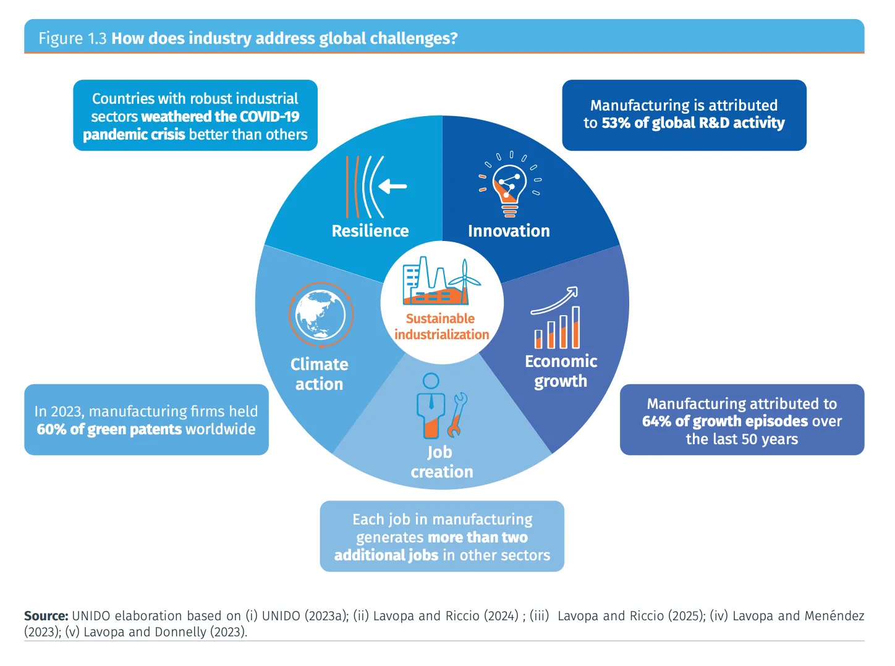
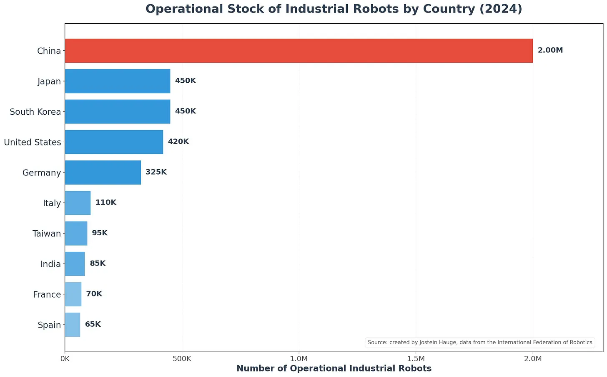

lang:fa
dir:rtl
title: چرا کشورهای در حال توسعه نمی‌توانند صنعتی‌سازی را نادیده بگیرند
subtitle: استدلال همیشگی برای توسعه‌ی مبتنی بر تولیدات کارخانه‌ای
date: 1404-11-29
author: (Jostein Hauge) یوستین هاوگ
summary: 
cover: image/hauge-industry/cover.jpg
featured: false

---
### توضیحات

در زمانه‌ای که مالی‌سازی، سفته‌بازی، سوداگری و فعالیت‌های غیرمولد رو بورس هستند و توسط اقتصادخوانده‌ها و پکیج‌فروشان تجویز میشوند، تاکید بر نقش صنعت و تولید در رشد پایدار و توسعه‌ی کشور بیش از پیش ضروری است. ایران، باوجود تحریم‌ها و تخاصم خارجی، همچنان به لطف منابع طبیعی سرشارش ظرفیت توسعه را دارد. و لازمه‌ی این توسعه، تولیدات کارخانه‌ای و برنامه‌ی توسعه‌ی صنعتی است.
یوستین هاوگ ([Jostein Hauge](https://substack.com/@haugejostein))، اقتصاددان و استاد دانشگاه کمبریج، در این مقاله با اتکا به داده‌ها و تجربه‌های تاریخی به نقش اساسی تولیدات کارخانه‌ای و داشتن بستر صنعتی برای توسعه‌یافتگی تاکید میکند. او همچنین به این نکته میپردازد که با وجود رقابتی که قدرت صنعتی چین ایجاد کرده، همچنان فرصت برای توسعه‌ی این بخش هست. و چین در موارد متعدد نشان داده است که از همکاری در این زمینه استقبال میکند. لازم به ذکر است که او مارکسیست نیست، بلکه اقتصاددانی با گرایش توسعه‌گراست و در پلتفرم ساب‌استک دارای [یک وبلاگ اقتصادی](https://www.theglobalcurrents.com/) است.
متن اصلی مقاله را میتوانید [اینجا](https://www.theglobalcurrents.com/p/why-developing-countries-cant-skip) به انگلیسی مطالعه کنید.

---

ایده‌ای که می‌گوید کشورهای در حال توسعه می‌توانند مرحله‌ی تولیدات کارخانه‌ای را از راه میانبر دور بزنند و مستقیماً به اقتصاد خدمات‌محور جهش کنند، روز به روز محبوب‌تر شده است. خدمات به منبع مهم‌تری برای رشد اقتصادی و فعالیت‌های تجاری تبدیل شده‌اند و بسیاری در مورد اینکه آیا صنعتی‌شدن سنتی همچنان اهمیت دارد — یا حتی امکان‌پذیر است — تردید دارند. رونق فرآیند برون‌سپاری خدمات تجاری در هند، موفقیت امارات در خدمات مالی و رشد مراکز تماس در فیلیپین همگی به عنوان شواهدی مطرح می‌شوند که نشان می‌دهند کشورها شاید بتوانند مستقیماً از تولید کارخانه‌ای بگذرند و آن را نادیده بگیرند.

بدون شک باید فرصت‌های جدید مبتنی بر خدمات را به رسمیت شناخت. اما این تصور که کشورها می‌توانند از صنعتی‌شدن صرف‌نظر کنند، عمدتاً نوعی رویاپردازی است. شواهد نشان می‌دهند که تعداد بسیار اندکی از کشورها بدون داشتن پایه‌ای قوی و رقابتی در بخش تولیدات کارخانه‌ای به مرحله‌ی توسعه یافته رسیده‌اند. دلیل این است که خدمات نمی‌توانند جایگزین آنچه تولیدات کارخانه‌ای به طور منحصربه‌فرد فراهم می‌کند شوند: رشد پایدار بهره‌وری، نوآوری، تجارت بین‌المللی و بنیان‌های محکم برای اقتصادی قوی.

## سوابق تاریخی واضح هستند

تقریباً هر کشوری که با موفقیت از فقر به ثروت رسیده، این تحول را از طریق صنعتی‌شدن ایجاد کرده است. بین سال‌های ۱۷۵۰ تا ۱۹۵۰، استقرار غرب به عنوان قدرت اقتصادی جهان در واقع فرآیند تبدیل شدن‌اش به قدرت هژمون تولیدی جهان بود. از سال ۱۹۵۰ به بعد، این الگو با ثبات قابل توجهی ادامه یافته است. [مطالعه‌ای که بانک جهانی در سال ۲۰۰۸ منتشر کرد](https://openknowledge.worldbank.org/server/api/core/bitstreams/df194a38-cb6f-5553-8fd8-e48a8a7c9574/content)، ۱۳ کشور را شناسایی کرد که برای دوره‌ای ۲۵ ساله یا بیشتر، رشد سالانه‌ای معادل ۷٪ یا بالاتر را حفظ کردند. در میان این «معجزه‌های رشد»، تنها دو کشور — بوتسوانا و عمان، هر دو کشورهای کوچک با ساختارهای اقتصادی بسیار خاص — بدون توسعه مبتنی بر تولیدات کارخانه‌ای به این موفقیت دست یافتند. تمام کشورهای دیگر در این فهرست، رونق خود را با گسترش توانایی‌های تولیدی خود بنا نهادند.

داده‌های متاخرترِ سازمان توسعه صنعتی ملل متحد (UNIDO) نیز به نتایج مشابهی رسیده‌اند. در [گزارش توسعه صنعتی ۲۰۲۶ آن‌ها](https://www.unido.org/idr/idr2026#/) آمده است که ۶۴ درصد از دوره‌های رشد در ۵۰ سال گذشته را می‌توان مستقیماً به تولیدات کارخانه‌ای نسبت داد. شواهد موردی این فرضیه را تقویت می‌کنند. دو کشور چین و ویتنام، که موفقیت‌ترین نمونه‌های توسعه اقتصادی در دوره اخیر از نظر رشد پایدار بوده‌اند، رشد سریع خود را از طریق صنعتی‌شدن مبتنی بر صادرات به دست آوردند. هر دو کشور در حال حاضر از قوی‌ترین اقتصادهای تولیدی جهان محسوب می‌شوند (چین بدون شک قوی‌ترین آن‌هاست).

در واقع، کل سوابق تاریخی نشان می‌دهند که هیچ کشوری به جز تعداد معدودی از دولت‌های غنی از منابع طبیعی (عمدتاً وابسته به نفت) یا قلمروهای مالی بسیار کوچک، بدون توسعه‌ی بخش تولیدی رقابتی به سطح زندگی بالا نرسیده است. به همین دلیل است که اصطلاحات «کشور صنعتی» و «کشور توسعه‌یافته» اغلب به جای یکدیگر به کار می‌روند.

سوی دیگر همین داستان را تأیید می‌کند. مناطقی که دچار کاهش زودرس سهم تولیدات کارخانه‌ای شده‌اند، کاهش سرعت رشد را تجربه کرده‌اند. آمریکای لاتین که در دهه‌های ۱۹۸۰ و ۱۹۹۰ دچار کاهش شدید سهم تولیدات کارخانه‌ای شد، شاهد کاهش سرعت رشد هم‌زمان با کاهش سهم تولیدات از تولید ناخالص داخلی بود. در آفریقا، کاهش زودرس سهم تولیدات کارخانه‌ای در همان دوره منجر به رشد اقتصادی منفی شد. حتی کشورهای عضو سازمان همکاری و توسعه اقتصادی (OECD) نیز در دهه‌های اخیر کاهش سرعت رشد را همراه با کاهش سهم تولیدات کارخانه‌ای تجربه کرده‌اند.

## تولیدات کارخانه‌ای همچنان موتور رشد بهره‌وری و نوآوری هستند

جذابیت جدید بخش خدمات قابل درک است و نباید آن را نادیده گرفت. بسیاری از خدمات دیجیتال واقعاً نوآوری و توسعه را فراهم می‌کنند. شهرهای بزرگ هند مانند بنگلور و حیدرآباد نمونه‌های بارزی هستند. اما هنگامی که به بررسی آنچه به طور بنیادین رشد بهره‌وری و نوآوری را پیش می‌برد می‌پردازیم، تولیدات کارخانه‌ای مزایای بنیادینی داردند که خدمات به سختی می‌توانند جایگزین آن شوند.

فعالیت‌های تولیدی راحت‌تر جای خود را به مکانیزه‌سازی و فرآوری شیمیایی میدهند. این امر، در ترکیب با سهولت تمرکز مکانی تولیدات کارخانه‌ای، پتانسیل رشد بهره‌وری را از طریق صرفه‌جویی‌های مقیاسی — هم ایستا بر اساس سطح تولید و هم پویا از طریق اثرات یادگیری از راه عمل — افزایش می‌دهد. این مزایا برای خدمات تکرارپذیر نیستند.

علاوه بر این، [مطالعاتی که از داده‌های جریانات ورودی-خروجی جهانی استفاده کرده‌اند](https://academic.oup.com/book/55163/chapter-abstract/424092730?redirectedFrom=fulltext&login=false) نشان می‌دهند که تولیدات کارخانه‌ای نسبت به خدمات بهره‌وری قابل توجه‌تری به سایر بخش‌ها سرریز کردند. تولیدات کارخانه‌ای همچنین پیوندهای عقب‌رو و پیش‌روی قوی‌تری دارند — یعنی ورودی‌ها را از طیف گسترده‌تری از بخش‌ها خریداری کرده و خروجی‌ها را به آن‌ها می‌فروشند — که تأثیر آن بر کلیت اقتصاد را تقویت می‌کند.

بُعد نوآوری شاید مهم‌ترین بخش باشد. شرکت‌های تولیدی هزینه‌های سنگینی را در تحقیق و توسعه (R&D) صرف می‌کنند و سرریزهای نوآورانه قوی‌ای را در سرتاسر اقتصاد ایجاد می‌کنند. [در واقع، ۵۳ درصد از فعالیت‌های جهانی تحقیق و توسعه به تولیدات کارخانه‌ای نسبت داده می‌شود](https://www.unido.org/idr/idr2026#/). تولیدات کارخانه‌ای پایه‌ی مادی نوآوری را فراهم می‌کنند، تقاضا برای فناوری‌های جدید ایجاد می‌کنند و امکان تجمع توانایی‌های تولیدی را فراهم می‌سازند که زیرساخت نوآوری‌های بعدی هستند. اگرچه برخی خدمات دانش‌محور مانند توسعه نرم‌افزار نیز نوآوری را پیش می‌برند، اما ارتباط بین تولیدات کارخانه‌ای و پیشرفت فناوری عمیق‌تر است.

شواهد و استدلال‌هایی که تاکنون ارائه شده‌اند، به‌خوبی در نمودار زیر — که از [گزارش توسعه صنعتی ۲۰۲۶ سازمان توسعه صنعتی ملل متحد (UNIDO)](https://www.unido.org/idr/idr2026#/) استخراج شده است — گردآوری شده‌اند؛ نموداری که نشان می‌دهد تولیدات کارخانه‌ای چگونه ارتباط محکمی با نوآوری، ایجاد اشتغال و توسعه‌ی اقتصادی دارد.

## تولیدات کارخانه‌ای موتور تجارت بین‌المللی است

یکی از دلایل محبوبیت روایت «انقلاب خدمات» این است که تجارت خدمات گسترش یافته است. به لطف دیجیتالی‌شدن و اینترنت، بسیاری از خدمات اکنون می‌توانند از راه دور ارائه شوند. خدمات فناوری اطلاعات هند، خدمات مالی بریتانیا و رشد فرآیند بیرون‌سپاری خدمات تجاری همگی به نظر می‌رسند خدمات را به عنوان موتور جدید توسعه‌ی مبتنی بر تجارت تأیید کنند.

اما هنگامی که شواهد را با دقت بررسی می‌کنیم، تولیدات کارخانه‌ای همچنان در تجارت بین‌المللی مسلط هستند، و این امر برای توسعه‌ی اقتصادی بسیار حائز اهمیت است. [صادرات کالاها (که عمدتاً توسط کالاهای تولیدی تشکیل شده‌اند) حدود ۸۰ درصد از کل صادرات جهانی را تشکیل می‌دهد](https://academic.oup.com/book/55163/chapter-abstract/424092730?redirectedFrom=fulltext&login=false)[^1]. صادرات به کشورها امکان می‌دهد تا تخصص پیدا کنند، به مقیاس دست یابند و رقابت‌پذیر شوند، که همه این‌ها رشد بهره‌وری و توسعه‌ی فناوری را تسریع می‌کنند. تولیدات کارخانه‌ای تاریخاً بسیار قابل‌تجارت‌تر از خدمات بوده‌اند و این مزیت همچنان پابرجاست.

کالاهای تولیدی ذاتاً قابلیت ذخیره‌سازی، استانداردسازی و حمل‌ونقل بیشتری نسبت به اکثر خدمات دارند. تولیدات کارخانه‌ای همچنین به شدت از «یادگیری از طریق صادرات» بهره می‌برند، [یعنی] شرکت‌های رقابتی در بخش تولید مجبور به نوآوری و بهبود بهره‌وری می‌شوند. یک کارخانه می‌تواند برای میلیون‌ها مصرف‌کننده جهانی تولید کند؛ در حالی که اکثر خدمات همچنان توسط تقاضای محلی محدود می‌شوند. برای کشورهای در حال توسعه که در تلاش برای دستیابی به تحول سریع هستند، اثبات شده که دسترسی به بازارهای جهانی از طریق صادرات تولیدی ضروری است.

البته برخی خدمات قابل‌تجارت نیز از این مزایا بهره می‌برند. با این حال، از آنجا که اکثریت خدمات قابل تجارت نیستند، هم‌بستگی بین صادرات و صنعتی‌شدن قوی‌تر است. هنوز کسی راهی برای اصلاح موهای کسی از راه دور، تمیز کردن خانه‌اش، سرو کردن غذایش، ساختن خانه‌اش یا هرس کردن چمن‌هایش پیدا نکرده است.

## خودکارسازی تهدیدی نیست که تصور می‌شود

شاید رایج‌ترین استدلال مخالفِ توسعه‌ی مبتنی بر تولیدات کارخانه‌ای در زمانه‌ی حاضر این باشد که خودکارسازی، شغل‌هایی را که در گذشته صنعتی‌شدن را برای توسعه بسیار قدرتمند کرده بود، از بین خواهد برد. اگر ربات‌ها بتوانند وظایف روتینی را که قبلاً میلیون‌ها نفر را در کارخانه‌های نساجی و خطوط مونتاژ به کار می‌گرفت انجام دهند، آیا خودکارسازی مسیر تولیدات کارخانه‌ای را برای کشورهای در حال توسعه‌ی امروزی مسدود نخواهد کرد؟

این ترس قابل درک است اما بیش از حد بزرگ‌نمایی شده است. از اولین انقلاب صنعتی، جوامع مداوما شاهد تحولات ناشی از تغییرات فناورانه در نیروی کار[^2] بوده‌اند. لودیت‌ها (Luddites) در سال ۱۸۱۱ از اینکه خودکارسازی شغل‌های نساجی را از بین خواهد برد وحشت داشتند — و برای برخی پیشه‌وران واقعاً همین اتفاق افتاد. اما صنعت به طور گسترده‌تر شاهد رشد اشتغال بود، چرا که خودکارسازی بهره‌وری را بالا برد، قیمت‌ها را کاهش داد و شغل‌های جدید ایجاد کرد.

اخیراً نیز، خودکارسازی در تولیدات کارخانه‌ای عموماً منجر به کاهش خالص اشتغال نشده است. [مطالعه‌ای بر روی شرکت‌های تولیدی اسپانیا از سال ۱۹۹۰ تا ۲۰۱۶](https://academic.oup.com/ej/article-abstract/131/638/2553/6124631?login=false) نشان داد که شرکت‌های استفاده‌کننده از ربات‌ها به دلیل افزایش تولید، اشتغال را افزایش دادند، حتی اگر شدت استفاده از نیروی کار کاهش یافته باشد. [سازمان توسعه صنعتی ملل متحد محاسبه کرده](https://www.unido.org/resources/publications/industrial-development-report-series/idr2020) که رشد موجودی ربات‌های صنعتی از سال ۲۰۰۰ تا ۲۰۱۴ تأثیر مثبتی بر اشتغال جهانی داشته است.

برای کشورهای در حال توسعه، موانع متعددی تأثیر خودکارسازی را محدود می‌کنند. بیشتر فناوری‌های خودکارسازی برای شرایط با دستمزد بالا توسعه یافته‌اند و تنها زمانی از نظر اقتصادی مقرون‌به‌صرفه می‌شوند که هزینه‌ی نیروی کار بالا باشد. در صنایع کارگرمحور (یا کاربر) مانند نساجی و فرآوری مواد غذایی، خودکارسازی اغلب نمی‌تواند با نیروی کار ارزان‌قیمت رقابت کند. [گزارشی از کنفرانس سازمان ملل متحد برای تجارت و توسعه](https://unctad.org/publication/trade-and-development-report-2017) تأکید می‌کند که «آنچه از نظر فنی امکان‌پذیر است همیشه از نظر اقتصادی سودآور نیست».

پیش‌بینی‌های پیشرفته‌ترین مطالعات، بازسازماندهی نیروی کار را به جای بیکاری انبوه پیش‌بینی می‌کنند. [شرکت مک‌کینزی تخمین می‌زند](https://www.sciencedirect.com/science/article/pii/S0016718520301871?via%3Dihub) که ۳ تا ۱۴ درصد از نیروی کار جهانی تا سال ۲۰۳۰ نیاز خواهند داشت تا به دسته‌های شغلی دیگر منتقل شوند — رقمی که با بازسازماندهی‌های تاریخی نیروی کار همخوانی دارد، نه یک بحران بی‌سابقه. خودکارسازی ممکن است تولیدات کارخانه‌ای را دگرگون کند، اما نقش آن را در توسعه اقتصادی از بین نخواهد برد.

صنعتی‌شدنِ کارگرمحور (یا کاربر) چین، به طور مشخص ایده‌ای که می‌گوید خودکارسازی لزوماً کارگران را جایگزین می‌کند را به چالش می‌کشد. جذب نیروی کار در اکوسیستم تولیدی چین در کنار پذیرش سریع ربات‌های صنعتی همچنان قوی باقی مانده است. اکوسیستم تولیدی چین در حال حاضر حدود ۲۰۰ میلیون کارگر را به کار گرفته است — بیش از یک‌چهارم نیروی کار ملی — که نشان‌دهنده ظرفیت استثنایی برای جذب نیروی کار است (تخمین‌ها بسته به تعریف اکوسیستم تولیدی متفاوت است).

این حفظ قوی اشتغال در بخش تولید (که اوج آن در اوایل دهه ۲۰۱۰ به دست آمد) به موازات یکی از سریع‌ترین نرخ‌های رشد پذیرش ربات‌های صنعتی در جهان رخ داده است. موجودی ربات‌های صنعتی نصب‌شده در چین از سال ۲۰۱۴ تا ۲۰۲۴ ده برابر شده است — از حدود ۲۰۰٬۰۰۰ به ۲٬۰۰۰٬۰۰۰. موجودی ربات‌های صنعتی چین در حال حاضر بالاترین در جهان است و تمام کشورهای دیگر را به شدت پشت سر گذاشته است.

اگرچه خودکارسازی بدون شک برخی کارگران را در بخش تولید چین جایگزین کرده است — و اشتغال در اکوسیستم تولیدی چین از اوج خود در اوایل دهه ۲۰۱۰ کمی کاهش یافته است — اما شواهد کلی نشان می‌دهند که جذب انبوه نیروی کار در تولیدات کارخانه‌ای می‌تواند هم‌زمان با گسترش فناوری‌های پیشرفته خودکارسازی صنعتی هم‌زیستی داشته باشد، و حتی همراه آن پیش رود.

## آیا چین صنعتی‌شدن دیگران را محدود می‌کند؟

سلطه‌ی تولیدی چین نگرانی آشکاری ایجاد می‌کند. اگر سهم چین از تولیدات جهانی، که اکنون به ۳۵ درصد می‌رسد، به رشد خود ادامه دهد، آیا این امر لزوماً فرصت‌های صنعتی‌شدن برای سایر کشورهای در حال توسعه را محدود نمی‌کند؟

ادعای اینکه سلطه‌ی تولیدی چین مانع صنعتی‌شدن در جاهای دیگر می‌شود، واقعیت کلیدی را نادیده می‌گیرد: تعداد بسیار اندکی از کشورها حتی قبل از رونق تولیدی چین موفق به صنعتی‌شدن شدند. اکثر کشورهایی که در دهه‌های ۱۹۶۰، ۱۹۷۰ و ۱۹۸۰ — خیلی قبل از اینکه چین به «کارخانه جهان» تبدیل شود — در تلاش برای توسعه‌ی توانایی‌های تولیدی خود با مشکل مواجه بودند، امروز نیز همچنان با همین مشکلات دست و پنجه نرم می‌کنند. چین موانع صنعتی‌شدنی را که اکثر کشورهای در حال توسعه با آن مواجه هستند ایجاد نکرده است.

نکته آشکارتر اینکه ویتنام، کشوری با چشمگیرترین رشد سرانه‌ی صادرات تولیدی، به شدت در اکوسیستم تولیدی چین ادغام شده است. موفقیت صنعتی ویتنام فرضیه‌ی «محدودسازی» را تکذیب می‌کند. به جای اینکه توسط رقابت چین مسدود شود، ویتنام با بهره‌گیری از ارتباطات خود با زنجیره‌های تأمین، فناوری و سرمایه‌گذاری چین، به سرعت توانایی‌های تولیدی رقابتی خود را ساخته است. این نشان می‌دهد که نزدیکی به بستر صنعتی چین می‌تواند زمانی که کشورها استراتژی‌های درستی را دنبال کنند، صنعتی‌شدن را ممکن سازد نه مسدود.

صعود چین چالش‌های واقعی ایجاد می‌کند — ریاضی ساده نشان می‌دهد که هرچه کشوری سهم بیشتری از کیک تولیدات جهانی را به دست آورد، تولیدات کمتری در جاهای دیگر انجام می‌شود. اما هنگامی که می‌بینیم چین با کشورهای در حال توسعه برای امکان‌پذیر ساختن توسعه‌ی زیرساخت‌ها، حاکمیت انرژی و فرصت‌های تولیدی همکاری می‌کند، شواهد آشکاری وجود دارد که صعود صنعتی چین همچنین امکاناتی برای تحول ساختاری ایجاد می‌کند.

[کتاب اخیری که به بررسی صعود چین در آفریقا پرداخته](https://www.cambridge.org/core/elements/global-china-for-africas-industrialization/AF0EBA3EA08F902BD3C6F59B1F15FBD5)، تأکید می‌کند که چین فرصت‌های واقعی صنعتی‌شدن را برای قاره فراهم می‌کند. این کتاب دو کانال را برجسته می‌کند که از طریق آن‌ها چین به صنعتی‌شدن در آفریقا کمک می‌کند: (الف) تأمین مالی و ساخت زیرساخت‌ها، و (ب) سرمایه‌گذاری مستقیم در تولیدات کارخانه‌ای. با این حال، کتاب تأکید می‌کند که نتایج ناهمگون هستند و به شدت به سیاست و عاملیت ملی بستگی دارند. دولت‌ها، شرکت‌ها و کارگران آفریقایی این نتایج را مذاکره میکنند، به چالش می‌کشند و شکل می‌دهند. به ویژه، توانایی دولت در نظارت بر سرمایه و هدایت فعال سیاست صنعتی حیاتی است.

## ساختن چیزها همچنان اهمیت دارد

بیشتر داستان‌های موفق توسعه — از انقلاب صنعتی بریتانیا تا تحول کره جنوبی و صعود چین — از کف کارخانه‌ها گذشته‌اند. تولیدات کارخانه‌ای از طریق صرفه‌جویی‌های مقیاسی، رشد بهره‌وری را پیش می‌برد که خدمات به سختی می‌توانند [این الگو را] تکرار کنند. سرریزهای نوآوری ایجاد می‌کنند که در سراسر اقتصاد گسترش می‌یابند. به کشورها امکان دسترسی به بازارهای جهانی را در مقیاسی می‌دهند که خدمات نمی‌توانند با آن رقابت کنند. و برخلاف ترس‌ها از اینکه خودکارسازی شغل‌های تولیدی را از بین می‌برد، کشورهایی مانند چین نشان می‌دهند که تولیدات کارخانه‌ای می‌توانند صدها میلیون کارگر را جذب کنند حتی در حالی که ربات‌ها گسترش می‌یابند.

البته خدمات بی‌اهمیت نیستند. پلتفرم‌های دیجیتال، خدمات مالی و فرآیند بیرون‌سپاری خدمات تجاری فرصت‌های واقعی برای توسعه ایجاد می‌کنند. اما نمی‌توانند جایگزین نقش تولیدات کارخانه‌ای به عنوان موتور رشد پایدار بهره‌وری و تحول ساختاری شوند. کشورهایی که از صنعتی‌شدن غفلت کرده‌اند — یا آن را زودتر از موعد از دست داده‌اند — هزینه‌ی آن را با رشد کندتر، کسری تجاری مداوم و کاهش ظرفیت نوآوری پرداخته‌اند.

کارخانه‌‌ی آینده متفاوت از کارخانه‌های گذشته خواهد بود. اما تولیدات کارخانه‌ای — تبدیل مواد اولیه به محصولات نهایی — همچنان در مرکز توسعه باقی خواهند ماند. مسیر رسیدن به رفاه همچنان از ساختن چیزها عبور می‌کند.

---

[^1]: یادداشت مترجم : اینجا منظور از کالا، goods یا کالای فیزیکی است، و نه کالا به معنای مارکسیستی آن که شامل خدمات نیز میشود.

[^2]: یادداشت مترجم : نیروی کار اینجا ترجمه‌ی workforce است و نه labour power
