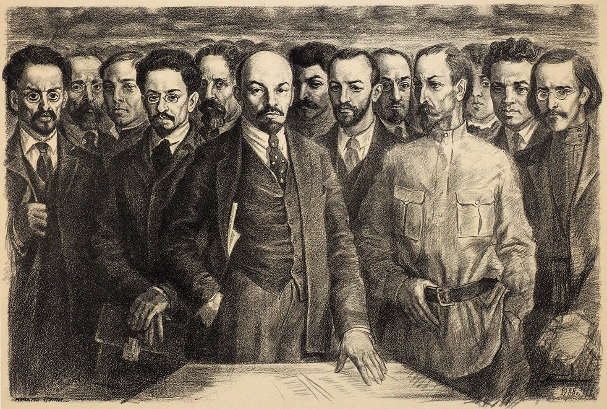

title: پیشتاز برای چه؟
date: 1404-11-22
author: پیشتاز
summary: مانیفست پیشتاز
cover: image/pishtaz/image.JPG
featured: true

باتوجه به شرایط خطیر کنونی در ایران، نیاز به یک پیشاهنگ انقلابی بیش از همیشه احساس میشود. آموزش سیاسی و فراگیری نظریه‌ی انقلابی یکی از شروط لازم برای شکل‌گیری و تاثیرگذاری این پیشاهنگ است. هرچند عده‌ای سعی در انکار آن دارند، تاریخ گواه این جمله‌ی جاودان از لنین است که «بدون نظریه‌ی انقلابی، انقلاب ممکن نیست». تنها جامع‌ترین، پیشروترین، علمی‌ترین و آزموده‌ترین نظریه میتواند این نقش را ایفا کند. این نظریه‌ی انقلابی برای رستگاری بشر که تمام این شروط را برآورده میکند، مارکسیسم-لنینیسم است.

مارکسیسم-لنینیسم یک چارچوب و دستگاه نظری ایستا نیست، بلکه علمی پویاست برای فهم جهان و جامعه‌ی بشری. تنها نظریه‌ای که در تاریخ باعث انقلاب و استقرار نظام سوسیالیستی شده است. نظریه‌ای که انقلاب کبیر اکتبر، مبارک‌ترین اتفاق تاریخ بشر، را رقم زد. نظریه‌ای که روسیه‌ی تزاری عقب افتاده را در مدت کوتاهی صنعتی و تبدیل به ابرقدرتی کرد که پوزه‌ی فاشیسم، این خلف شرور و بربر سرمایه‌داری، را به خاک مالید. نظریه‌ای که باعث ایجاد توازن قوایی بی‌سابقه به نفع طبقه‌ی کارگر و تمام ستم‌دیدگان جهان شد؛ توازن قوایی که از یک سو باعث امتیازگیری کارگران شد، و از سوی دیگر موج استعمارزدایی راه انداخت. نظریه‌ای که در سرتاسر جهان حماسه آفرید، از کره تا ویتنام تا کوبا. نظریه‌ای که ۸۰۰ میلیون چینی را از فقر مطلق رها کرد و باعث جهش اقتصادی بی‌سابقه‌ای در تاریخ شد. آری، مارکسیسم-لنینیسم نظریه‌ی انقلاب و رهایی بشر است.

پدیدار شدن افق انقلابی نیازمند توده‌ای شدن تفکر و نظریه‌ی انقلابی، و گسترش آگاهی طبقاتی است. لازمه‌ی این امر آموزش، تهییج و افشاگری سیاسی است. آگاهی طبقاتی به طور خود به خودی و از سر احساسات خودانگیخته و تجربه‌ی زیسته درمیان کارگران توسعه نمیابد. همانطور که در میهن خود مشاهده میکنیم، باوجود یکی از وحشیانه‌ترین اشکال استثمار سرمایه دارانه و تهاجم امپریالیستی، نه تنها آگاهی سیاسی در میان توده‌های زحمتکش تقویت نشده، بلکه آنان در بهترین حالت مستاصل هستند و در بدترین حالت در آغوش ارتجاعی‌ترین و شرورترین نیروهای ضدبشری تاریخ جا خوش کرده‌اند. این آگاهی باید از بیرون توسط یک پیشاهنگ انقلابی به آنان تزریق شود. همانطور که برای درمان خود به پزشکان نیاز داریم و برای ساخت بنا سراغ معمار میرویم، طبقه‌ی کارگر نیز برای پیشبرد منافع‌اش و ساخت آینده‌ای سوسیالیستی به تربیت نیرویی متخصص نیاز دارد. مبارزه برای سوسیالیسم، از سه جبهه‌ی سیاسی، اقتصادی و تبلیغاتی به جلو می‌رود. اما متاسفانه، در شرایط کنونی ایران، هنوز یک نیروی واقعا موجود انقلابی شکل نگرفته است که اساسا بتوانیم همچین مبارزه‌ای را شروع کنیم.

مارکسیسم-لنینیسم از رفقای پیشین به ما به ارث رسیده است، با گذر زمان در آزمایشگاه تاریخ آزموده شده و جلا یافته است. در وحله‌ی اول، وظیفه‌ی ما فراگیری و پاسداری از شاکله‌ی انقلابی مارکسیسم-لنینیسم و انسجام نظری آن است. سپس، از یک سو سعی کنیم آن را در ساحت انتزاعی ارتقا ببخشیم، و از سوی دیگر با ارائه‌ی تحلیل انضمامی از شرایط انضمامی به دنبال فهم وضعیت کنونی خود باشیم تا بتوانیم استراتژی و تاکتیک انقلابی تدوین کنیم برای انکشاف مبارزات طبقاتی در ایران و همراه کردن توده‌های زحمتکش. لازمه‌ی پیاده سازی این برنامه تربیت یک نیروی انقلابی است و تربیت این نیروی انقلابی نیازمند بستری است برای به اشتراک‌گذاری محتوای آموزشی و نظری.

پیشتاز متولد شده است تا پلتفرمی باشد برای به اشتراک‌گذاشتن مقالات و مباحث نظری با جهان‌بینی مارکسیستی-لنیستی. در بلندمدت، امید داریم که تبدیل شود به مرجعی برای تمام سوسیالیست‌ها و کسانی که به دنبال رهایی طبقه‌ی کارگر و تمام توده‌ها از یوغ استثمار هستند. پیشتاز، همانطور که از نامش پیداست، به دنبال ارتباط مستقیم با توده‌ها نیست. به دنبال محیا کردن فضایی برای شروع این ارتباط است. به دنبال آموزش گسترده‌ی نیروهای مترقی است. در اینجا تلاش داریم در میان همهمه‌ی بنگاه‌های خبری و محتوای آغشته به خون امپریالیستی تحت هژمونی سنگین نیروهای سرمایه، صدا و دیدگاه مقاومت کنندگان در برابر این هجمه را بالا ببریم.

اهداف پیشتاز را میتوان در موارد زیر خلاصه کرد :
- آموزش و توضیح اصول مارکسیسم-لنینیسم 
- به اشتراک گذاشتن تحلیل‌های مختلف از طرف دیگر متفکران (غالبا مارکسیست) در زمینه‌های مختلف
- تحلیل انضمامی شرایط انضمامی ایران و جهان

منتهی، این تلاش نیازمند همکاری گسترده‌ی کمونیست‌هاست. از این رو، از تمام رفقا دعوت میکنیم به ما کمک کنند تا این پروژه‌ی مهم را به پیش ببریم. از نوشتن مقاله تا ترجمه‌ی دیگر مقالات، پذیرای همیاری رفقا هستیم. برای شروع، سایتی را طراحی و عملیاتی کرده‌ایم برای به اشتراک‌گذاشتن مقالات، و در نظر داریم در آینده این فعالیت را به دیگر اشکال محتوایی گسترش بدهیم اگر نیرو و امکانش موجود بود.
درنهایت، هدف ما فراهم کردن بستر پیدایش حزب توده‌ای طبقه‌ی کارگر برای پیشبرد مبارزه برای سوسیالیسم است. مبارزه‌ای که بیش از هر زمان دیگری، با وجود طبقه‌ی سرمایه‌دار خودفروخته‌ی ایرانی الزامی به نظر میرسد برای بقای ایران و ایرانیان.

آمده‌ایم تا کاری را که پیشینیان ما شروع کرده‌اند را ادامه بدهیم. آمده‌ایم تا با قلم تباهی دهر را به چشم جهانیان پدیدار کنیم، تا زمینه را برای گسستن این بند بندگی در سرتاسر جهان، به هرصورتی که هست، مهیا شود.