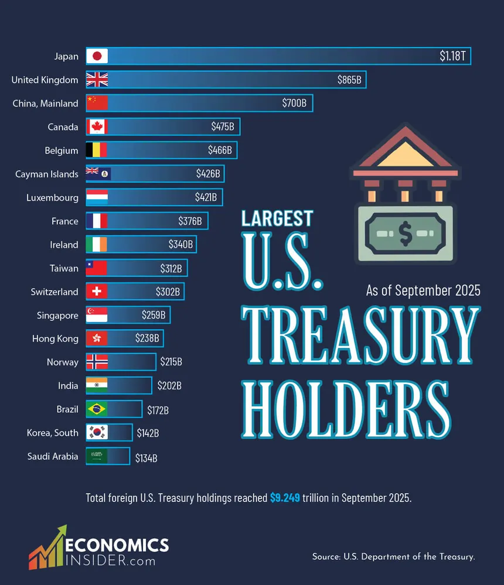
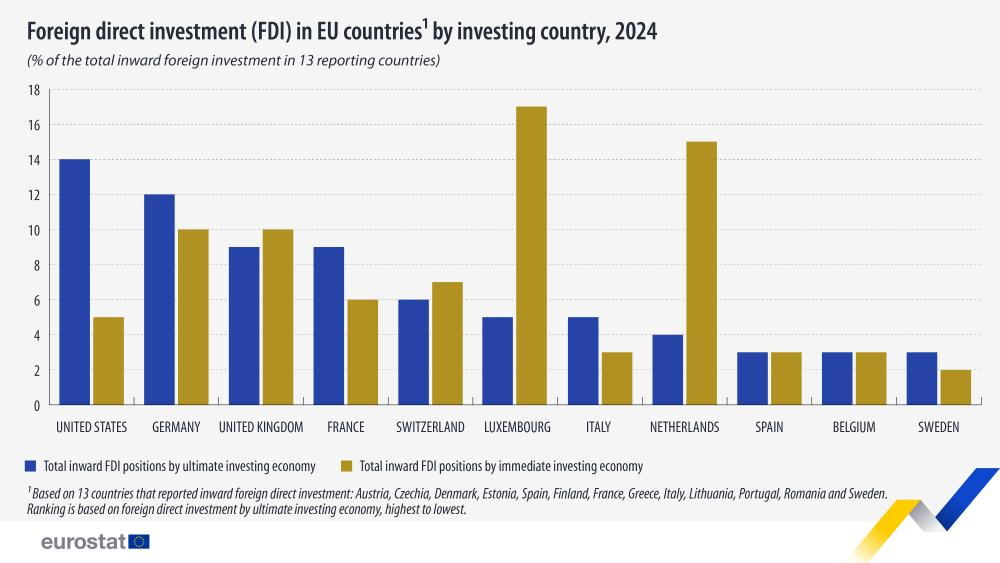
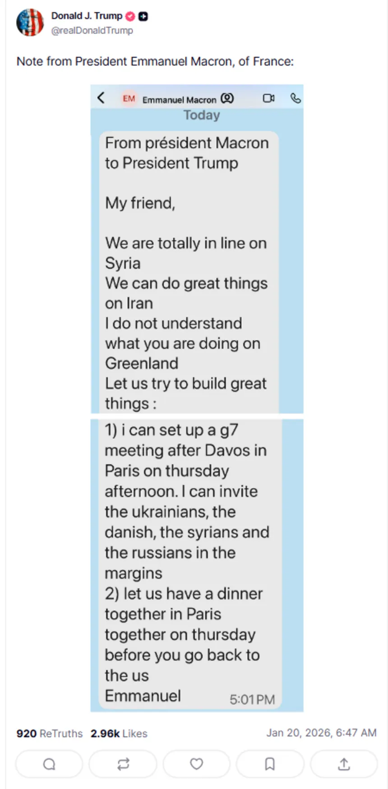

lang:fa
dir:rtl
title: ظهور رایش آمریکایی و ضرورت بازیابی جبهه‌ی متحد ضدفاشیسم
date: 1404-11-27
author: (پیشتاز) یحیی ستاری
summary: سخنرانی اخیر مارکو روبیو اعلامیه‌ی نیمه رسمی تشکیل جبهه‌ای در سطح جهانی است : امپریالیسم غربی علیه بشریت. و همگی به خوبی میدانیم که یک جبهه دو طرف بیشتر ندارد.
cover: image/american-empire/navy.jpg
featured: true

# مقدمه
کمی بیش از یک سال از شروع ریاست جمهوری دونالد ترامپ میگذرد، و در همین مدت نسبتا کوتاه، تهاجم کم‌سابقه‌ای را علیه جهان پیرامون شروع کرده است. حمایت بیشتر از نسل‌کشی در غزه، حمله به یمن، فشار به حزب الله در لبنان، جنگ تعرفه‌ای، جنگ ۱۲ روزه علیه ایران، تشدید تنش علیه چین، محاصره و حمله به ونزوئلا، محاصره و تشدید تحریم‌ها علیه کوبا، و تشدید تحریم‌ها و تهدید حمله به ایران نمونه‌هایی از تخاصم‌های اخیر ایالات متحده هستند. 

آمریکا حتی به متحدان خودش نیز رحم نکرده و از بدو شروع به کار ترامپ انواع و اقسام امتیازگیری‌ها را از متحدان خود انجام داده. از مجاب کردن پادشاهی‌های نفتی خلیج فارس به سرمایه‌گذاری‌های هنگفت در آمریکا گرفته تا تحمیل قرارداد تجاری‌ای نابرابر به اروپا. آن‌ها حتی از این هم فراتر رفتند و خواهان الحاق گرینلند که بخشی از دانمارک و نتیجتا اتحادیه اروپا شدند که باعث افزایش تنش بین دو سوی اقیانوس شد. [پارلمان اروپا حتی تصویب قرارداد تجاری اخیر را هم عقب انداخت](https://www.lemonde.fr/en/international/article/2026/01/20/eu-parliament-freezes-us-trade-deal-after-trump-s-tariff-threats-over-greenland_6749625_4.html). همچنین، رویکرد تهاجمی و خصمانه‌ی دولت مستقر در واشنگن نسبت به کانادا باعث شد این کشور به شکل بی‌سابقه‌ای با بستن یک قرارداد بزرگ تجاری به چین نزدیک شود، و [نخست وزیرش حرفایی علیه هژمونی آمریکایی بزند که معمولا انتظار نمیرود از دهان یک رییس حکومت غربی بیرون بیاید](https://geopoliticaleconomy.com/2026/01/23/west-imperialism-canada-mark-carney-wef-china/).
با این حال،‌ نباید گول این اختلافات ظاهری را خورد. جبهه بندی‌ها کاملا مشخص هستند، و غرب به وضوح مشکلی با جنگ و ویرانی برای نگه داشتن تسلط خودش ندارد، و در این مسئله، همگی متحد هستند.
در مقابل اما، جبهه‌ی ضدهژمونیک،  که چین و روسیه قوی‌ترین اعضای آن‌اند، نسبتا مستاصل بوده. با اینکه در دفع کردن مقطعی تهاجم به خودشان مستحکم ایستادند و فعلا موفق بوده‌اند[^1]، در مقابل تهاجم به دیگران، با وجود حمایت‌های سیاسی و لوجستیکی، بیشتر در سطح تماشاچی باقی ماندند.

غرب نشان داده که قصد عقب‌نشینی ندارد، دائما تهاجمی‌تر شده و به وضوح هدفشان جلوگیری از فروپاشی هژمونی غربی به هر قیمتی است. این یعنی چین و روسیه[^2]، به تعبیر محبوب نسل‌کشان که این روزها زیاد تکرار میکنند، «سر مار» و اهداف اصلی این تهاجم گسترده‌ی غرب علیه بشریت هستند.

بعید به نظر میرسد که چینی‌ها و روس‌ها از این نقشه غافل باشند. سوال اصلی این است که چه استراتژی‌ای برای مقابله دارند؟ و موضع ما نسبت به این تحولات چه باید باشد؟

# امپریالیسم غربی به رهبری آمریکا

نظم امپریالیستیِ تحت هژمونی آمریکا فردای جنگ جهانی دوم زاده شد وقتی که امپریالیسم‌های اروپایی و ژاپنی ابتدا در حین این جنگ، سپس با موج استعمارزدایی پساجنگ نابود شدند. از طرفی دیگر، اتحاد جماهیر شوروی به عنوان کشوری که بیشترین سهم را در شکست فاشیسم داشت، به مقبولیتی عظیم در سطح جهانی به خصوص در اروپا دست یافت. بورژوازی‌های امپریالیست کشورهای ویران شده که هم به خاطر همدستی با فاشیسم منفور شده بودند، و هم توسط جنگ ضعیف شده بودند، لاجرم دست به دامان آمریکا شدند. از پلان مارشال تا ناتو، اروپا هرچه بیشتر به آمریکا وابسته شد. البته، از بقل این وابستگی سود بسیاری کرد. هم از غارت جنوب جهانی که آمریکا به واسطه‌ی تحریم، کودتا و جنگ زحمت به زانو درآوردن‌اش را میکشید، هم به واسطه‌ی مقابله‌ی همه جانبه‌ی این کشور با کمونیسم در سطح جهانی من جمله در اروپا، ژاپن و کره‌ی جنوبی.

سرمایه‌داری غربی تماما وابسته و حل شده در نظام آمریکایی است. ژاپن، کانادا، آلمان و بریتانیا به ترتیب ۸۱۹، ۸۱۱، ۶۷۷ و ۶۶۷ میلیارد دلار سرمایه گذاری مستقیم در آمریکا انجام داده‌اند و صدرنشین هستند[^3]. این روند برای این کشورها صعودی بوده، در صورتیکه شرکت‌های چینی با کم‌تر از ۵۰ میلیارد دلار سرمایه‌ی درگیر، از سال ۲۰۱۷ سرمایه‌گذاری خود را کاهش داده‌اند.

سهم سهام‌های آمریکایی از کل ارزش سهام‌هایی که تحت مدیریت صندوق‌های سرمایه‌ی حوزه‌ی یورو هست، از سهم سهام‌های حوزه‌ی یورو بیشتر شده. ارزش کل سرمایه‌گذاری‌های اروپایی در بازار سهام آمریکا در ۲۰۲۴ به ۱۴.۵ تریلیون دلار هم رسید و میشود تصور کرد الان از این مبلغ هم بیشتر شده است.

همچنین، این کشورها (ژاپن، اروپا و کانادا) دارندگان اصلی اوراق قرضه‌ی ایالات متحده هستند و سهمشان در طول این سال‌ها، همزمان با کم شدن سهم چین،‌ بیشتر هم شده.

از سمت دیگر، آمریکا هم بزرگ‌ترین سرمایه‌گذار در اروپاست و در سال ۲۰۲۴ با ۱۴% بیشترین سهم را در میان بقیه‌ی کشورها داشته. این جدای سهم هنگفت صندوق‌های سرمایه و بازنشستگی آمریکایی در شرکت‌های اروپایی مانند ASML، LVMH، توتال و غیره است. اما همچنان سرمایه‌داران اروپایی بیشتر در آمریکا سرمایه دارند تا بالعکس.

همه‌ی این داده‌ها نشان میدهند برای بورژوازی اروپایی، آمریکا بیشتر اهمیت دارد تا خود اروپا، و این وابستگی نه تنها کم نشده است بلکه بسیار بیشتر از گذشته شده است. این نکته همدستی، تحرکات و حقارت سران اروپایی درمقابل آمریکا را تا حدود زیادی توضیح میدهد.

# غربِ وحشی، وحشی‌تر میشود

افول هژمونی غرب هرروز شتاب بیشتری میگیرد و تسلطی که قبلا در تمام حوزه‌های اقتصادی، نظامی، تکنولوژیک و غیره داشته‌اند، تقریبا از بین رفته است. رشد اقتصادی خیره‌کننده‌ی چین با جهش انقلابی این کشور در حوزه‌ی تکنولوژیک همراه شده. از خودروهای برقی و انرژی‌های نو تا صنعت نیمه‌هادی‌ها و عناصر خاکی کمیاب، این کشور نه تنها به سطح غربی‌ها رسیده، بلکه در بسیاری از موارد از آن‌ها جلو افتاده[^4]. تحریم‌ها و جنگ در اوکراین بیشتر از آن‌که روسیه را زمین‌گیر کرده باشد، کشورهای عمده‌ی اروپایی مانند آلمان را وارد بحران و رکود کرده. چین بدون اعتنا به تحریم‌های غربی، دائما نفت کشورهای تحریم شده مانند روسیه، ایران و ونزوئلا را میخرد. حتی آمریکا هم در جنگ دوم تجاری علیه چین شکست میخورد و مجبور به عقب‌نشینی میشود. به علاوه، روسیه و چین فعال شدن مکانیسم ماشه علیه ایران توسط کشورهای اروپایی را رد میکنند و علنا در شورای امنیت جلوی غربِ یکپارچه می‌ایستند.

پاسخ غرب دربرابر این افول نه برنامه‌ریزی و سعی در احیای صنعت و اعتبار خودش در همکاری با دیگر کشورها، بلکه توحش بیشتر بوده. از حمایت و همدستی در نسل‌کشی غره گرفته تا حمله به ایران و ونزوئلا،‌ و هم‌اکنون کوبا، تمامی قواعد نظمی که خودشان برقرار کردند را زیرپا گذاشتند.

۱۴ فوریه ۲۰۲۶، در کنفرانس امنیتی مونیخ، مارکو روبیو[^5] رسما تعارف را گذاشت کنار، و هر آنچه سران غربی همیشه در خفا به آن باور داشتند را علنی بازگو کرد. او سخنرانی‌اش را با اشاره به خواستگاه ضدکمونیستی این کنفرانس که برای مقابله با تهدید شوروی تاسیس شده بود شروع کرد. این که چگونه غرب، متحد و به تعبیر او پیروز شد علیه «بزرگ‌ترین تهدید تاریخ بشر» :‌ کمونیسم! طبیعتا نباید انتظار داشت گوسانوی محبوب آمریکا در روز ولنتاین، معشوق خود یعنی فاشیسم را، که باعث مرگ حداقل ۷۰ میلیون نفر شد، به عنوان بزرگ‌ترین تهدید تاریخ بشر معرفی کند!
او خاطر نشان کرد که شیدایی حاصل از فروپاشی شوروی به آنان این اعتماد به نفس و تصور را داد که به «پایان تاریخ» رسیدند، و این تصور «احمقانه» و «زیان‌بار» بود. تصوری که به نظر او باعث شد از غرب صنعت‌زدایی بشه و پولی که باید صرف «دفاع» میشده، صرف سیاست‌های رفاهی شده. البته مارکو این را نمیگوید که «صنعت‌زدایی» برای استثمار نیروی کار ارزان بوده و اگر چین جسارت نمیکرد خودش را توسعه بدهد و از غرب پیشی بگیرد، مشکلی با این قضیه نداشتند. این را هم نمیگوید در همان دورانی که به گفته‌ی او پول کافی صرف نظامی‌گری نمیکردند، ناتو بسیار بسیار بیشتر از جمع بودجه‌ی نظامی بقیه‌ی جهان پول خرج جنگ میکرده. او پس از مدح تمدن غربی، توضیح داد که اروپا میتواند به آن‌ها در جنگی که علیه همه شروع کرده‌اند بپیوندد تا با هم سوار جهان بشوند و آن را غارت کنند. اینکه قرار نیست به «نظم جهانی» پایبند باشند چون منافع‌شان را تامین نمیکند.

اما متفاوت‌ترین بخش سخنرانی‌اش از این جا شروع میشود. او با شور و شوقی زیاد از تاریخ استعماری غرب گفت و آن را تمجید کرد :

> برای پنج قرن، پیش از پایان جنگ جهانی دوم، غرب در حال گسترش بود — ماموران مذهبی (میسیونرها)، زائران، سربازان و کاوشگرانش از سواحل خود راه می‌افتادند تا از اقیانوس‌ها عبور کرده، قاره‌های جدید را استعمار کنند و امپراتوری‌های گسترده‌ای را بسازند که در سراسر جهان گسترش یافته بود.

در ادامه از کمونیست‌ها و جنبش‌های ضداستعماری گلایه میکند که این عظمت را نابود کردند :

> اما در سال ۱۹۴۵، برای اولین بار از زمان [کریستف] کلمب، [غرب] در حال کوچک شدن بود. اروپا ویران شده بود. نصف آن پشت پرده آهنی قرار گرفته بود و نیمه دیگر نیز به نظر می‌رسید که به زودی دنبال آن خواهد آمد. امپراتوری‌های بزرگ غربی وارد مرحله انحطاط نهایی شده بودند، که این انحطاط توسط انقلاب‌های کمونیستی بی‌خدایانه و شورش‌های ضداستعماری تسریع شده بود، شورش‌هایی که در سال‌های آینده جهان را دگرگون کرده و داس و چکش سرخ را بر بخش‌های گسترده‌ای از نقشه گسترش دادند.

باید اعتراف کنم که به عنوان یک کمونیست، از نوحه‌ی مارکو در غم استعمار از دست رفته و نقش کمونیست‌ها در این اتفاق احساس غرور کردم!
مارکو در ادامه تاکید کرد که قرار نیست این افول را بپذیرند :

>در چنین شرایطی، همان‌طور که امروزه، بسیاری باور کردند که دوران تسلط غرب به پایان رسیده و آینده‌ی ما سرنوشتی تلخ و تکراری از گذشته خواهد بود. اما پیشینیان ما دریافتند که این انحطاط یک انتخاب است، انتخابی که آنها نمی‌پذیرند. ما این کار را قبلاً یکبار انجام داده‌ایم[^6] و این همان چیزی است که رئیس‌جمهور ترامپ و ایالات متحده امروزه می‌خواهند دوباره با شما انجام دهند.

او در ادامه تاکید میکند که غرب نباید شرمی از این گذشته‌ی درخشان استعماری‌اش داشته باشد :

> به همین دلیل است که نمی‌خواهیم متحدان ما با گناه و شرم سرخورده باشند. ما می‌خواهیم متحدانی داشته باشیم که به فرهنگ و میراث خود افتخار میکنند، کسانی که می‌فهمند ما وارثان همان تمدن بزرگ و شریف هستیم، و همراه با ما آماده و توانا هستند که از آن دفاع کنند.

او ادامه میدهد :
> و به همین دلیل است که ما نمی‌خواهیم متحدان ما وضعیت درهم‌شکسته‌ی موجود را توجیه کنند، بلکه با آنچه برای اصلاح آن لازم است مواجه شوند، چرا که ما در آمریکا علاقه‌ای نداریم که به عنوان مراقبان مودب و منظم افول مدیریت‌شده‌ی غرب باشیم. ما به دنبال جداسازی نیستیم، بلکه می‌خواهیم دوستی قدیمی را دوباره زنده کرده و بزرگ‌ترین تمدن تاریخ انسانی را تجدید حیات کنیم. ما می‌خواهیم یک اتحاد تجدید شده‌ای داشته باشیم که درک کند مشکلات جوامع ما تنها یک مجموعه از سیاست‌های بد نیست، بلکه یک بیماری از ناامیدی و رضایت از وضع موجود است. یک اتحاد، اتحادی می‌خواهیم که توسط ترس از تغییرات اقلیمی، ترس از جنگ و ترس از فناوری، به بی‌اقدامی دچار نشود. بلکه می‌خواهیم اتحادی داشته باشیم که با جرأت به سوی آینده بدود. و تنها ترسی که ما داریم، ترس از شرم این است که نتوانیم کشورهایمان را برای فرزندانمان با افتخار بیشتر، قوی‌تر و ثروتمندتر به جا بگذاریم.

در نهایت سخنرانی‌اش را با تمجید از استعمارگران اروپایی که آمریکا را ساختند و تاکید دوباره بر لزوم اتحاد غرب (تحت فرمان و دست‌نشاندگی آمریکا) تمام کرد که مورد تشویق پرشور حضار از جمله مقامات بلندپایه‌ی اروپایی قرار گرفت. صدالبته، مارکو هنگام روایت تاریخ زیبای آمریکا، به بومیانی که نسل‌کشی شدند، یا آفریقایی‌هایی که با زنجیر همچون احشام به آمریکا برده شدند برای بردگی اشاره‌ای نکرد.

کمونیست‌ها در طول تاریخ تلاش طاقت‌فرسایی برای افشای شرارت و سلطه‌طلبی امپریالیسم داشته‌اند. اما مارکو با یک سخنرانی تمام پرده‌ها را کشید کنار و کار ما را ساده‌تر کرد. از این جهت، نه تنها گوسانوی محبوب آمریکا، بلکه گوسانوی محبوب ما هم هست!

از شوخی گذشته، این سخنرانی حاوی نکات بسیار مهم است که به ما در فهم مسیری که جهان در حال پیمودن است کمک میکند. مرزها هرچه بیشتر درحال مشخص‌تر شدن هستند، و آنطور که از گفته‌های مقامات اروپایی پیداست، به نظر میرسد اروپا قرار است به دعوت آمریکا لبیک بگوید. [در دسامبر ۲۰۲۵، ناتو رسما تعهد کرد بودجه‌ی نظامی را به ۵٪ جی‌دی‌پی برساند](https://www.nato.int/en/what-we-do/introduction-to-nato/defence-expenditures-and-natos-5-commitment)، هرچند این تعهد [با چالش‌های زیادی روبروست](https://www.cnbc.com/2025/06/24/this-chart-shows-how-far-nato-allies-need-to-hike-to-get-to-5percent-of-gdp.html). در جریان همین کنفرانس مونیخ، اورسولا فون در لاین، رئیس کمیسیون اتحادیه اروپا، [از صنایع غیرنظامی اروپا مثل خودروسازی‌ها خواست که به ساخت جنگ افزار رو بیاورند](https://x.com/mosbatboy/status/2023096960060932308?s=46). امانوئل مکرون، رئیس جمهور فرانسه، هم در پیامی به ترامپ قصد داشت دست از سر گرینلند بردارد تا به «کارهای بزرگ»شان درمورد ایران و بقیه برسند. حتی درمیان سوسیال دموکرات‌های اروپا هم مقاومتی دربرابر این روند مشاهده نمیشود. نخست وزیر دانمارک، که تمامیت و حاکمیت ارضی کشورش توسط آمریکا و نه روسیه تهدید میشود، [خواستار تسلیح اوکراین برای حمله به عمق خاک روسیه شده](https://x.com/glenn_diesen/status/2023049096953532527?s=46). نخست وزیر اسپانیا از حزب سوسیالیست هم [مشکلی با هزینه‌ی بیشتر در امور نظامی ندارد و بیشتر روی جزئیات نقد وارد میکند](https://x.com/clashreport/status/2022747080910074240?s=46).
همچنین، ترامپ اوایل سال جاری میلادی درخواست کرد بودجه‌ی نظامی آمریکا، که سال پیش هزار میلیارد دلار را رد کرد، به [۱۵۰۰ میلیارد دلار افزایش یابد](https://www.politico.com/news/2026/01/07/trump-calls-record-defense-budget-00715298).

پس به نظر میرسد اجماعی فراگیری در غرب برای حفظ و بازیابی هژمونی به هرقیمتی وجود دارد، و ابایی از نشان دادن این قصد ندارند. با پیروزی قاطع سانائه تاکایچی در انتخابات، ژاپن هم به احتمال زیاد به این جمع اضافه خواهد شد. همدستی اروپایی‌ها و فرمان‌برداری‌اشان از آمریکا هم، به دلیل درهم‌تنیدگی سرمایه‌ی اروپایی و آمریکایی که در بخش قبل تشریح کردیم، جای تعجب ندارد. همچنین افتخار روبیو به استعمار، و اینکه کمونیسم را تهدید بزرگ‌تری از فاشیسم قلمداد میکند جای تعجب ندارد. واقعیت این است که غرب (مخصوصا آمریکا) با فاشیسم مشکلی نداشتند، بلکه با او مراودات فراوانی داشتند و به این امید بودند که کار شوروی را یک سره کند. آمریکا هرگز به آلمان نازی اعلام جنگ نکرد، و اگر در عمل انجام شده قرار نمیگرفت با اعلام جنگ نازی‌ها، هرگز وارد جنگ با آن‌ها نمیشد و روی ژاپن تمرکز میکرد. همانطور که ژاک پولز، تاریخدان بلژیکی، در کتابش «کسب و کار بزرگ با هیتلر»[^7] توضیح میدهد، آمریکایی‌ها تجارت پرسودی با رژیم نازی داشتند و از لحاظ مالی و لوجستیکی آن‌ها را تامین میکردند. نازی‌ها هم شدیدا تحت تاثیر تاریخ و جریانات نژادپرست آمریکایی بودند.
این بار اما به نظر میرسد وارثان فرهنگ و تمدن غربی نمیخواهند اشتباه پیشینان خود را تکرار کنند و الکی با یکدیگر بجنگند. این بار میخواهند راهی را که رایش سوم شروع کرد را به ثمر برسانند. با تاسیس رایش چهارم غربی میخواهند میراث خود را که نسل‌کشی، کشتار، غارت و نابودی در چهار گوشه‌ی جهان است را حفظ و به حد اعلا برسانند.

# ضرورت تشکیل جبهه‌ای واحد و فراگیر علیه هژمونی غرب

درمقابل، کشورهای ضدهژمونیک مستاصل هستند. متاسفانه، مقابل این جبهه‌ی غربی هنوز جبهه‌ای واحد و مستحکم شکل نگرفته است. شاید مهم‌ترین دلیل آن، غالب بودن بورژوازی کمپرادوری در اکثر کشورهای این شبه‌بلوک باشد. در کشورهایی مانند ایران، بورژوازی از استیصال و غیرممکن بودن پیوستن به ارباب خود به سر حد جنون رسیده و انهدام‌طلبی را در پیش گرفته است به این امید که از خاکستر باقی مانده، کشوری وصل به مدار امپریالیسم بیرون بیاید. دیگر کشورهای عمده که لزوما ضدهژمونیک نیستند (مانند برزیل، هند، اندونزی،...) یا در این توهم هستند که میتوانند همچنان از توبره‌ی رابطه با غرب بخورند هم از آخور رابطه با چین، یا بورژوازی‌های کمپرادورشان به تکه نانی که غرب از بر استثمار کارگران و منابع کشورشان جلویشان می‌اندازد راضی هستند.

مهم‌تر از همه، سیاست‌های چین به عنوان یک کشور عمده‌ی سوسیالیستی ناامیدکننده بوده است. این را میدانیم که چین کمک‌های فراوان دیپلماتیکی، اقتصادی و لوجستیکی میکند. میدانیم که چین پل، راه‌آهن، جاده و خطوط برق میسازد. درک میکنیم که چین به خاطر وابستگی‌اش به منابع خارجی و همچنین نیازش به تراشه‌های غربی، دارای محدودیت‌های فراوانی است که لزوما شوروی به واسطه‌ی ثروت عظیم طبیعی‌اش با آن‌ها مواجه نبود.
اما چین دارای ابزارهای فراوانی نیز هست، همانطور که در جنگ تعرفه‌ای نشان داد. چین میتوانست بخشی از این ابزارها را برای فلسطین به کار ببرد. همانطور که تجربه نشان داد، تعلل در عمل یاعث شد آمریکا اعتماد به نفس و جسارت گسترش تهاجمات خود به ایران و ونزوئلا، سپس کوبا را پیدا کند. محافظه کاری بیش از حد و انفعال در عمل، آن هم در شرایطی که آمریکا آشکارا شمشیر را از رو بسته‌است و صریحا چین را تهدید میکند، میتواند خیلی سریع خود چین را مقابل غرب تنها بگذارد. و این دفعه، برخلاف جنگ جهانی دوم، همگی در غرب عضو نیروهای محور هستند.

استعمارگران قرار است بار دیگر به سواحل بقیه‌ی جهان برای غارت نزدیک بشوند، اما این بار سوار بر سانتا ماریا‌ی چوبی نیستند، سوار بر ناو هواپیمابر لینکلن هستند. غرب هزاران میلیارد دلار خرج امور نظامی میکند که از آن استفاده کند، نه صرفا برای ترساندن بقیه. این‌ها هزینه‌ی لایروبی مسیرهای انباشت سرمایه هستند. بحران‌ها در سرمایه‌داری اجتناب‌ناپذیرند، و وقتی این بحران‌ها مثل امروز فرامیرسند، نوبت به تشدید استثمار و تخریب میرسد برای هموار کردن دوباره‌ی انباشت. انباشتی که قرار است از طریق غارت کشورهای پیرامونی تامین شود. پس، هر آن‌کس که همچنان در توهم آن است که میتواند از بغل این نظام پوسیده که تحت فرمان غرب است، به نان و نوایی برسد، سخت در اشتباه است. کشتی‌های استعمار بالاخره به سراغشان خواهند آمد، و بهتر است آن موقع ناآماده و تنها نباشند. اما این آینده محتوم نیست. مقاومت لاجرم شکل خواهد گرفت. همانطور که انترناسیونال ترقی‌خواه در [کمپینی](https://nuestraamericaflotilla.org/) قصد دارد ناوگانی برای شکستن حصر کوبا شکل دهد. درست است که امپریالیسم قدرتمند است، اما این توحش‌اش از سر ترس و ضعف است، نه قدرت مطلق.
ضرورت تشکیل جبهه‌ای واحد و فراگیر علیه هژمونی غرب بیش از پیش حس میشود. وظیفه‌ی اصلی بر عهده‌ی قدرت‌های عمده‌ی مقابل غرب یعنی چین و روسیه است. قصور در این امر میتواند برای کل بشریت گران تمام شود. ما نیز باید فعال‌تر بشویم. بنویسیم، افشاگری کنیم، اعتصاب کنیم، مقابل بورژوازی فاسد کشورمان بایستیم. درمقابل جریان‌های برانداز، که چیزی جز پیاده‌نظامان این تهاجم استعماری نیستند، بایستیم. پهلوی، مدنی‌زاده، سلاح‌ورزی و بقیه‌اشان همگی در جبهه‌ی امپریالیسم قرار دارند. هم نیروهای ترقی‌خواه باید از توهم مترقی کردن براندازی دربیایند؛ هم نیروهای مستضعف و کارگری طرفدار ج‌ا باید از توهم امکان مقاومت در بستر اقتصاد-سیاسی سرمایه‌دارانه، آن هم در شکل نئولیبرالی خود دربیایند.
سخنرانی اخیر مارکو روبیو اعلامیه‌ی رسمی تشکیل جبهه‌ای در سطح جهانی است : امپریالیسم غربی علیه بشریت. و همگی به خوبی میدانیم که یک جبهه دو طرف بیشتر ندارد. 
هرچه که میگذرد، به دوراهی «سوسیالیسم یا بربریت» نزدیک‌تر میشویم. امپریالیسمِ مست از خون، بربریت را انتخاب کرده است. امید است که در دیالکتیک مبارزه با این شرارت، بشریت سوسیالیسم را انتخاب کند.

____
### پانوشت‌ها و منابع

[^1]: مانند پیروزی چین در جنگ تعرفه‌ها، و پیشروی روسیه در اوکراین.

[^2]: مخصوصا چین به عنوان یک کشور سوسیالیستی.

[^3]: https://www.jetro.go.jp/usa/japan-us-investment-report/

[^4]: https://itif.org/publications/2024/09/16/china-is-rapidly-becoming-a-leading-innovator-in-advanced-industries/

[^5]: سخنرانی کامل روبیو در [صفحه‌ی X](https://x.com/StateDept/status/2022581890268696689?s=20) وزارت امور خارجه‌ی آمریکا.

[^6]: به اتحاد غرب علیه شوروی و کمونیسم اشاره میکند.

[^7]: Big Business avec Hitler, Jacques Pauwels
